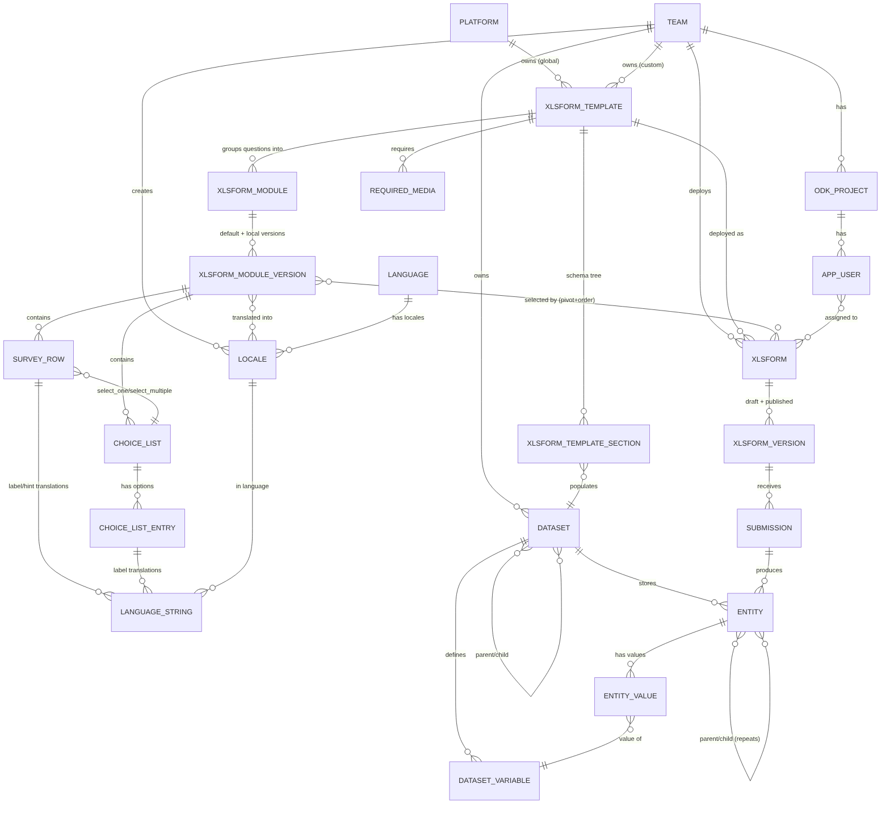
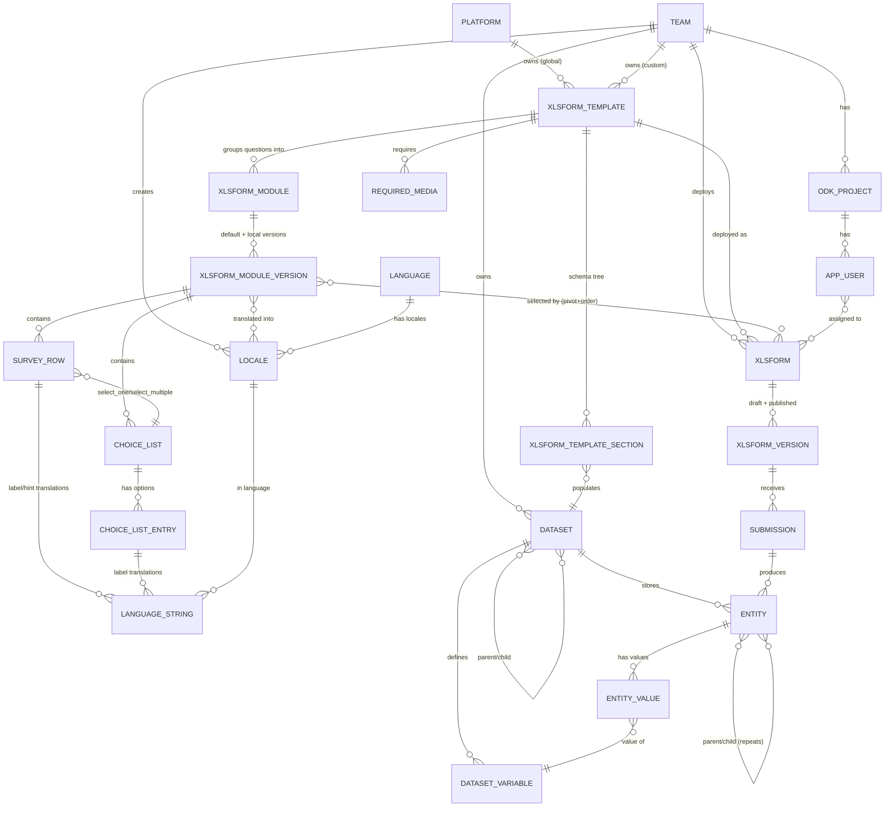
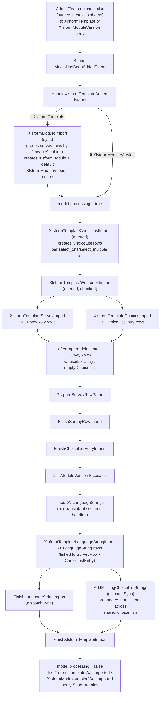
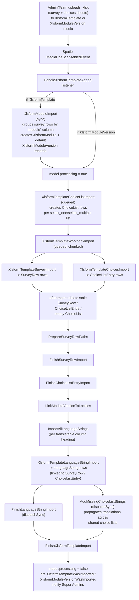
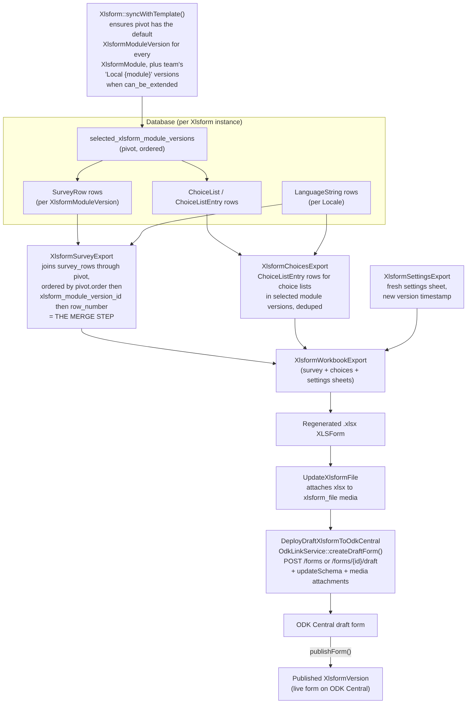
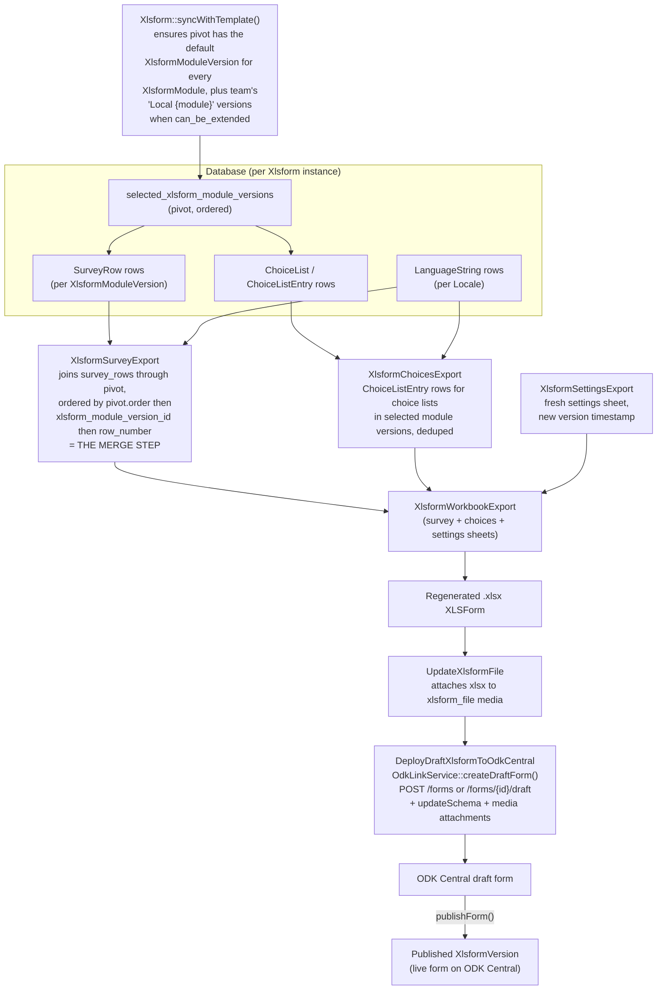
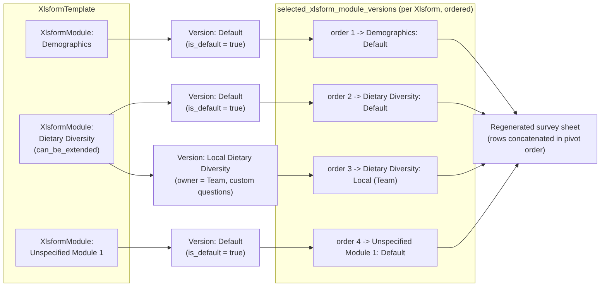
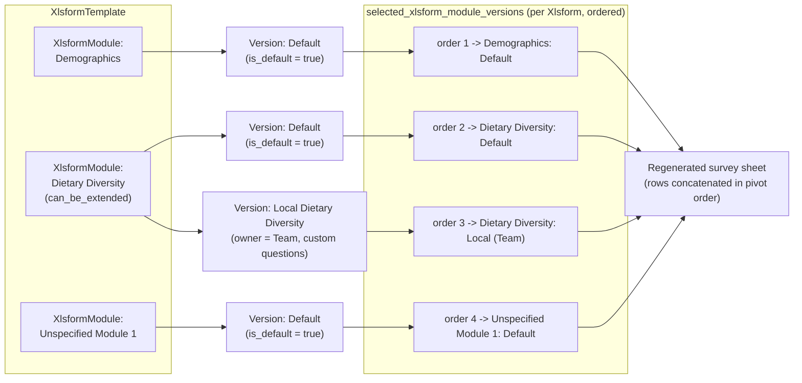
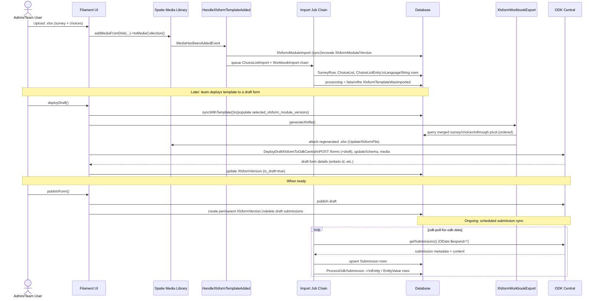
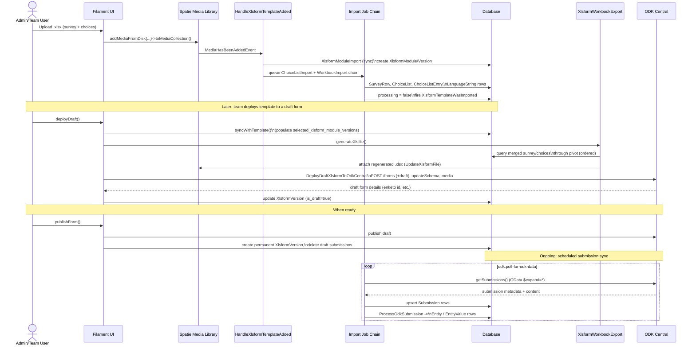

# `stats4sd/filament-odk-link` — Package Study Notes

Package location: `/home/dan/Sites/filament-odk-link` (loaded into groundswell_platform via composer path repository, namespace `Stats4sd\FilamentOdkLink\`).

This document is a reference guide for working with the package: data model, services/jobs, Filament UI, and the import/export (XLSForm) pipeline.

---

## 0. Configuration & Host App Integration (`config/filament-odk-link.php`)

```
models.form_owner    = env('ODK_FORM_OWNER_MODEL', 'App\Models\Team')   // the "owner" of all xlsforms/datasets/etc
models.user_model    = env('ODK_USER_MODEL', 'App\Models\User')

odk.aggregator         = env('ODK_SERVICE', 'odk-central')
odk.url                = env('ODK_URL')
odk.base_endpoint      = "{ODK_URL}/v1"
odk.platform_project_id = env('ODK_PLATFORM_PROJECT_ID')
odk.username/password  = platform "owner" account credentials (owns every deployed form)
odk.project-password   = password for per-project app-user accounts

storage.xlsforms / storage.media = disks for XLSX files / submission attachments

roles.xlsform-admin = env('XLSFORM_ADMIN_ROLE', 'admin')  // role that sees ALL forms, not just owned ones
owners.main_type     = env('MAIN_OWNER_TYPE', 'team')

submission.process_method.{class,method}              // host-app hook called after each submission is processed
submission.foreign_key_process_method.{class,method}  // declared but not currently called anywhere
```

### What a host app (groundswell_platform) must provide

1. `config('filament-odk-link.models.form_owner')` → a model (here: `App\Models\Team`) that:
   - uses `Stats4sd\FilamentOdkLink\Models\OdkLink\Traits\HasXlsforms` (pulls in `HasXlsformTemplates`)
   - implements `WithXlsforms` (and transitively `WithXlsformTemplates`)
2. `User` model can use `HasOdkCentralAccount` + implement `WithOdkCentralAccount` for ODK Central login sync.
3. Models that are the "subject" of submissions (e.g. `Farm`) use `HasSubmissions` + implement `IsPrimaryDataSubject` (must provide `updateCompletionStatus()`).
4. Models auto-created from ODK Entities implement `IsCreatedFromOdkSubmissions::createFromOdkEntity()`.
5. Optionally configure `submission.process_method` for custom submission→table processing (called from `ProcessOdkSubmission` job).

`src/OdkLinkAdmin.php` and `src/OdkLinkTeam.php` are Filament **Plugin** classes registering resources/widgets into the Admin panel and a tenant ("Team") panel respectively. `src/FilamentOdkLink.php` is currently an empty stub class (not used).

---

## 1. Data Model

All namespaces `Stats4sd\FilamentOdkLink\Models\...`.

### 1.1 Core "Form Definition" Domain: Template → Module → ModuleVersion → Form → Version

#### `XlsformTemplate` (`src/Models/OdkLink/XlsformTemplate.php`, table `xlsform_templates`, migration `001`)
- Extends abstract `HasXlsformDrafts`, implements `IsXlsformTemplate`. Uses `HasRelationships` (eloquent-has-many-deep), `HasUploadedXlsformFile`.
- Casts: `schema` → collection, `odk_draft_updated_at` → timestamp.
- Key columns: `title`, `description`, `available` (public template flag), `owner_id`/`owner_type` (polymorphic, nullable = platform-owned), ODK draft fields (`odk_id`, `odk_draft_token`, `has_draft`, `enketo_draft_id`, `draft_needs_update`, `odk_draft_updated_at`, `odk_error`, `odk_version_id`), `schema` (json), `main_dataset_id` (FK → datasets), `processing` (bool), soft-deletes.
- **Represents the "master" XLSForm definition** — a reusable form blueprint that gets cloned per-team into `Xlsform` records.

Relationships:
- `owner(): MorphTo` — `Platform` or host form-owner (`Team`), null = platform-owned.
- `xlsforms(): HasMany` → `Xlsform` (all team copies); `activeXlsforms(): HasMany` (where `is_active`)
- `submissions(): HasManyThrough` → `Submission` via `Xlsform`
- `requiredMedia(): HasMany` → `RequiredMedia`
  - `requiredFixedMedia` / `requiredDataMedia` (filtered by `type != 'file'` / `= 'file'`)
  - `attachedFixedMedia` / `attachedDataMedia` (further filtered to ones with media or linked dataset/choiceList)
- `datasets(): BelongsToMany` → `Dataset` via pivot `required_media` (pivot model `RequiredMedia`), pivot cols `name, type, is_static, exists_on_odk`
- `xlsformTemplateSections(): HasMany` → `XlsformTemplateSection`
  - `repeatingSections()` (`is_repeat = true`), `rootSection(): HasOne` (`structure_item = 'root'`)
- `xlsformModules(): HasMany` → `XlsformModule` (FK `xlsform_template_id`)
- `xlsformDefaultModuleVersions` (computed) — each module's `defaultXlsformVersion`
- Deep relations through `[XlsformModule, XlsformModuleVersion]`:
  - `surveyRows()`, `choiceLists()`, `choiceListEntries()` (extra hop through `ChoiceList`), `surveyLanguageStrings()`, `choiceListEntryLanguageStrings()`
- `locales` (computed) — intersection of locales across each module's default version

Lifecycle (booted hooks):
- `deleting`: removes from ODK Central, deletes `xlsformModules`
- `saving`: if `newXlsfile` set, attach as media `xlsform_file`
- `created`: `afterXlsformFileUpdated()`
- `saved`: if `odk_draft_updated_at` changed → `afterXlsformFileUpdated()` (extracts sections, marks all team Xlsforms `has_latest_template = false`); if `available = true`, auto-`deployTo()` the owner team or every team with `should_receive_all_xlsform_templates = true`
- `extractSections()` — parses `schema` JSON into `XlsformTemplateSection` rows for repeat groups + root, builds `DatasetVariable` records for sections linked to datasets.

#### `Xlsform` (`src/Models/OdkLink/Xlsform.php`, table `xlsforms`, migration `002`)
- Extends `HasXlsformDrafts`, implements `HasMedia`. Uses `HasRelationships`.
- Casts: `schema` → collection, `odk_draft_updated_at`/`odk_published_at` → timestamp, `has_locales` → bool.
- Key columns: `xlsform_template_id` (FK, cascade), `owner_id` (FK to team table, cascade — **the per-team deployment**), `title`, draft fields + active/live fields (`odk_version_id`, `is_active`, `enketo_id`, `odk_published_at`), `processing`, `schema`, `has_latest_template`, `has_latest_media`, `draft_needs_update`, `live_needs_update`.
- **Represents a specific team's instance/deployment of an `XlsformTemplate`** — maps 1:1 to an ODK Central form (`odk_id`).

Relationships:
- `xlsformTemplate(): BelongsTo` → `XlsformTemplate`
- `xlsformVersions(): HasMany` → `XlsformVersion`; `xlsformDraftVersion(): HasOne` (`is_draft = true`)
- `submissions(): HasManyThrough` → `Submission` via `XlsformVersion`
- `locales(): BelongsToMany` → `Locale` (pivot `locale_xlsform`)
- `localeList` (computed) — `locales` if `has_locales`, else `owner->locales`
- `requiredMedia()`, `attachedFixedMedia()`, `attachedDataMedia()` — delegate to `xlsformTemplate`
- `xlsformModuleVersions(): BelongsToMany` → `XlsformModuleVersion` via pivot `selected_xlsform_module_versions`, `withPivot('order')`, ordered — **the "module composition" of this team's form**
- `surveyRows()`, `choiceLists()`, `choiceListEntries()` — `HasManyDeep` through `[selected_xlsform_module_versions, XlsformModuleVersion(, ChoiceList)]`

Lifecycle:
- Global scope `owned` filters by `owner_id` = current tenant (`HelperService::getCurrentOwner()`)
- `saved`: if `!has_latest_template`, calls `syncWithTemplate()`; if `draft_needs_update` flips false, fires `XlsformDraftWasDeployed` (if `live_needs_update` also true)
- `created`: calls `setup()` → `syncWithTemplate()` + `deployDraft()`
- `deleting`: removes from ODK Central
- `syncWithTemplate()` — for each `XlsformModule` of the parent template (sorted by `default_order`), if this Xlsform lacks a version for that module, attaches the module's `defaultXlsformVersion` with pivot `order`. If module `can_be_extended`, also creates/attaches a "Local {module name}" `XlsformModuleVersion` owned by this team, immediately after.
- `status` (computed) — PROCESSING / NOT DEPLOYED / LIVE / DRAFT READY FOR TESTING / INACTIVE
- `xlsformId` (computed) — slugified title + id
- `getOdkLink` — link into ODK Central UI

#### `XlsformVersion` (`src/Models/OdkLink/XlsformVersion.php`, table `xlsform_versions`, migration `009`)
- Plain `Model implements HasMedia`, uses `InteractsWithMedia`.
- Columns: `xlsform_id` (FK), `version`, `odk_version`, `schema` (collection cast), `active` (bool), `is_draft` (bool — column not in migration `009`, likely added later).
- **A specific published/draft snapshot of an `Xlsform`** — corresponds to an ODK Central form version.

Relationships:
- `xlsform(): BelongsTo` → `Xlsform`
- `submissions(): HasMany` (without `ignore_drafts` scope), `liveSubmissions()` (default scope), `draftSubmissions()` (`onlyDraftData()` scope)

#### `XlsformModule` (`src/Models/OdkLink/XlsformModule.php`, table `xlsform_modules`, migration `003`)
- Uses `HasRelationships`.
- Columns: `xlsform_template_id` (FK, cascade), `label`, `name`, `default_order`. Casts: `can_be_extended`/`can_be_replaced` → bool, `row_names` → collection. Unique `(xlsform_template_id, name)`.
- **A logical "section/module" of a template** (e.g. "Household Roster") that can have multiple alternative versions.

Relationships:
- `xlsformModuleVersions(): HasMany` → `XlsformModuleVersion`
- `defaultXlsformVersion(): HasOne` (`is_default = true`)
- `xlsformTemplate(): BelongsTo` → `XlsformTemplate`
- `defaultSurveyRows()`, `defaultChoiceLists()` — `HasManyThrough` via default version
- `defaultLocales(): HasManyDeep` through `[XlsformModuleVersion, XlsformModuleVersionLocale]` where default

Lifecycle: on `created`, auto-creates a default `XlsformModuleVersion` named `"Global {module name}"` with `is_default = true`.

#### `XlsformModuleVersion` (`src/Models/OdkLink/XlsformModuleVersion.php`, table `xlsform_module_versions`, migration `004`)
- `Model implements HasMedia`, uses `HasRelationships`, `InteractsWithMedia`.
- Columns: `xlsform_module_id` (FK, nullable, cascade), `owner_id` (FK to team, nullable, nullOnDelete — a team's custom module version), `name`, `is_default` (bool), `processing`. Unique `(xlsform_module_id, name)`.
- **A concrete, versioned implementation of a module** — an actual set of `SurveyRow`s + `ChoiceList`s. "Global X" = shared default; teams can have "Local X" custom versions.

Relationships:
- `xlsformModule(): BelongsTo` → `XlsformModule`
- `country(): BelongsTo` → `Country`
- `surveyRows(): HasMany` (ordered by `row_number`)
- `choiceLists(): HasMany`; `choiceListEntries(): HasManyThrough` via `ChoiceList`
- `locales(): BelongsToMany` via pivot `xlsform_module_version_locale` (pivot model `XlsformModuleVersionLocale`, `withPivot('needs_update')`)
- `xlsformModuleVersionLocales(): HasMany`
- `surveyLanguageStrings(): HasManyThrough` via `SurveyRow`
- `choiceListEntryLanguageStrings(): HasManyDeep` through `[ChoiceList, ChoiceListEntry]`
- `xlsforms(): BelongsToMany` via pivot `selected_xlsform_module_versions`, `withPivot('order')`
- `owner(): BelongsTo` → host form-owner model, nullable

#### `XlsformTemplateSection` (`src/Models/OdkLink/XlsformTemplateSection.php`, extends `Pivot`, table `xlsform_template_sections`, migration `021`)
- Casts: `schema` → collection. Global scope: ordered by `is_repeat asc, id asc`.
- Columns: `dataset_id` (FK, nullOnDelete), `xlsform_template_id` (FK, cascade), `parent_id` (self-FK, nullOnDelete), `structure_item`, `is_repeat`, `schema`, `is_current`, `data_subject_dataset_id` (referenced in model, not in migration `021` — added later).
- **A repeat group / root structure within a template's schema**, optionally linked to a `Dataset`.

Relationships:
- `parent()` / `children()` — self-referential tree of nested repeat groups
- `xlsformTemplate(): BelongsTo`
- `dataset(): BelongsTo` → `Dataset` (the dataset this section populates)
- `dataSubjectDataset(): BelongsTo` → `Dataset` via `data_subject_dataset_id` (the "primary subject" dataset, e.g. Farm)
- Also acts as the pivot for `Dataset::xlsformTemplateSources()` (`BelongsToMany` `XlsformTemplate` ↔ `Dataset`, `withPivot(['structure_item','is_repeat','schema'])`)

---

### 1.2 Survey Content Domain: SurveyRow, ChoiceList, ChoiceListEntry

#### `SurveyRow` (`src/Models/OdkLink/SurveyRow.php`, table `survey_rows`, migration `006`)
- Implements `WithLanguageStrings`; uses `CascadesDeletes`, `HasLanguageStrings`.
- Columns: `xlsform_module_version_id` (FK, cascade), `row_number`, `name`, `repeat_group_path`, `path`, `type`, `choice_list_id` (FK, nullOnDelete), `required`, `relevant`, `appearance`, `calculation`, `constraint`, `choice_filter`, `repeat_count`, `default`, `note`, `trigger`, `properties` (json/collection), `updated_during_import`. Unique `(xlsform_module_version_id, name, type)`.
- Casts: `properties` → collection, `required`/`updated_during_import` → bool.
- **A single XLSForm "survey" sheet row** (a question/field) belonging to a module version.

Relationships: `xlsformModuleVersion(): BelongsTo`; `choiceList(): BelongsTo` (if select_one/multiple); `languageStrings(): MorphMany` (via `HasLanguageStrings`); `cascadeDeletes = ['languageStrings']`.

Computed: `typeAndChoiceList` — full ODK `type` string including `list_name` for selects.

Lifecycle: `saved` — marks all `xlsforms()` (via `xlsformModuleVersion`) `draft_needs_update = true`.

#### `ChoiceList` (`src/Models/OdkLink/ChoiceList.php`, table `choice_lists`, migration `005`)
- Columns: `xlsform_module_version_id` (FK, cascade), `list_name`, `description`, `is_localisable`, `is_dataset`, `can_be_hidden_from_context`, `has_custom_handling`, `properties` (json). Unique `(xlsform_module_version_id, list_name)`.
- Casts: `properties` → collection, `can_be_hidden_from_context`/`is_localisable` → bool.
- **An XLSForm "choices" sheet list** (`list_name`) scoped to a module version.

Relationships: `choiceListEntries(): HasMany`; `xlsformModuleVersion(): BelongsTo`; `surveyRows(): HasMany` (rows referencing this list).

`getOwnedEntries(WithXlsforms $owner)` — entries that are global (no owner) OR owned by `$owner`.

Lifecycle: `deleting` — cascades delete to all `choiceListEntries`.

#### `ChoiceListEntry` (`src/Models/OdkLink/ChoiceListEntry.php`, table `choice_list_entries`, migration `007`)
- Implements `WithLanguageStrings`; uses `IsLookupList`, `BelongsToThrough` (Znck), `HasLanguageStrings`.
- Columns: `choice_list_id` (FK, cascade), `owner_id` (FK to team, nullable — null = global entry), `name`, `properties` (json), `cascade_filter`, `updated_during_import`. Unique `(name, choice_list_id, cascade_filter)`.
- Casts: `is_localisable`, `is_dataset`, `properties` (collection), `updated_during_import`.
- **A single choice/option row** in a choice list — globally shared or team-customized.

Relationships:
- `choiceList(): BelongsTo`
- `xlsformModuleVersion(): BelongsToThrough` (through `ChoiceList`)
- `model(): MorphTo` — optional polymorphic link to a custom data model (see `IsCreatedFromOdkSubmissions`)
- `owner(): BelongsTo` → host form-owner (nullable)
- `ownersWhoRemovedFromContext(): BelongsToMany` via pivot `choice_list_entries_removed_owner` (migration `024`)
- `languageStrings()` via `HasLanguageStrings`

Lifecycle: global scope `owner` (current tenant OR `owner_id IS NULL`); `saved` — marks linked `xlsformModuleVersion->xlsforms()` `draft_needs_update = true`; `deleting` — cascades delete `languageStrings`.

Methods: `canBeHiddenFromContext()`, `isRemoved($team)`, `toggleRemoved($team)`.

---

### 1.3 Dataset / Entity Domain (internal "Entity Lists" abstraction)

#### `Dataset` (`src/Models/OdkLink/Dataset.php`, table `datasets`, migration `000`)
- `Model implements HasMedia`, `InteractsWithMedia`.
- Columns: `model_id`/`model_type` (polymorphic, nullable), `name` (unique), `label` (display variable), `parent_id` (self-FK, cascade), `primary_key`, `description`, `entity_model`, `external_file` (bool), `lookup_table` (bool), `is_universal` (bool), soft-deletes.
- **Abstraction over ODK Central "Entity Lists" (Datasets)** — a logical table of entities (e.g. "farms", "households") that can be populated from submissions, used as `select_one_from_external` lookup sources, and optionally linked to a host-app Eloquent model (`model` morph).

Relationships:
- `owner(): BelongsTo` → host form-owner
- `parentDatasets()`/`childDatasets()`: self `BelongsToMany` via `dataset_parents` pivot (`child_id`→`parent_id`, pivot model `ParentDatasetPivot`)
- `parent()`/`children()`: separate self hierarchy via `parent_id`
- `choiceList(): BelongsTo` → `ChoiceList` (Dataset↔ChoiceList duality flagged as TODO to merge)
- `odkDatasets(): HasMany` → `OdkDataset`
- `variables(): HasMany` → `DatasetVariable`
- `entities(): HasMany` → `Entity`
- `model(): MorphTo` — host-app model link
- `xlsformTemplateSections(): HasMany`; `dataSubjectXlsformTemplateSections(): HasMany` (via `data_subject_dataset_id`)
- `xlsformTemplateSources(): BelongsToMany` → `XlsformTemplate` via `xlsform_template_sections` pivot
- `requiredMedia(): HasMany`; `xlsformTemplates(): BelongsToMany` via `required_media` pivot

#### `DatasetVariable` (`src/Models/OdkLink/DatasetVariable.php`, table `dataset_variables`, migration `016`)
- Columns: `dataset_id` (FK), `name`, `label`, `type`, `value_type`, `description`.
- **A column/property of a Dataset** (the schema of an entity list).

Relationships: `dataset(): BelongsTo`; `datasetParentPivot(): HasOne` via `foreign_key_variable_id`; `entities(): BelongsToMany` via `entity_values` pivot (pivot model `EntityValue`, `withPivot('value')`); `values(): HasMany` (FK `entity_id` — likely a naming oddity).

#### `Entity` (`src/Models/OdkLink/Entity.php`, table `entities`, migration `015`)
- Columns: `dataset_id` (FK, cascade), `parent_id` (self-FK, cascade), `owner_id` (FK to team, cascade), `model_id`/`model_type` (nullableMorphs), `submission_id` (FK to submissions, cascade).
- **A single record/row in a Dataset (an ODK Central "Entity")** — e.g., one farm, one household member from a repeat group.

Relationships: `parent()`/`children()` self; `submission(): BelongsTo`; `dataset(): BelongsTo`; `owner(): BelongsTo`; `model(): MorphTo`; `values(): HasMany` → `EntityValue`; `datasetVariables(): BelongsToMany` via `entity_values` pivot (`entity_id` ↔ `dataset_variable_name`, `withPivot('value')`).

Computed: `primaryKey` (value of EntityValue matching `dataset->primary_key`), `label` (value matching `dataset->label`).

Lifecycle: `created` — if dataset's `primary_key === 'uuid'` and no uuid set, generates UUID + corresponding `EntityValue`.

Methods: `addValues(Collection $entries)` (bulk inserts EntityValue, dedupes name collisions with `.1`/`.2` suffixes); `addChildEntities(Collection $entities, Dataset $dataset)` (creates child Entities + EntityValues from repeat groups, expanding `select_multiple` via `OdkLinkService::makeMultiSelectBooleansFromSurveyRow`).

#### `EntityValue` (`src/Models/OdkLink/EntityValue.php`, table `entity_values`, migration `018`)
- Columns: `entity_id` (FK, cascade), `dataset_variable_name` (FK referencing `dataset_variables.name`, cascade), `value` (text). Unique `(entity_id, dataset_variable_name)`.
- **EAV-style key/value store for entity attribute values**, keyed by variable name.

Relationships: `datasetVariable(): BelongsTo` (joins `dataset_variable_name = name`); `entity(): BelongsTo`; `odkProject(): BelongsTo` (no `odk_project_id` column found in migration `018` — likely dead code/unused).

#### `ParentDatasetPivot` (`src/Models/OdkLink/ParentDatasetPivot.php`, extends `Pivot`, table `dataset_parents`, migration `033`)
- Columns: `parent_id`, `child_id` (both FK → datasets, cascade), implied `foreign_key_variable_id` (used by `DatasetVariable::datasetParentPivot()` though not in migration `033` — likely added later).
- **Pivot for Dataset-to-Dataset parent/child relationships**, with `foreignKeyVariable()` identifying which `DatasetVariable` on the child dataset links back to the parent.

Relationships: `parent(): BelongsTo` → Dataset (`parent_id`); `child(): BelongsTo` → Dataset (`child_id`); `foreignKeyVariable(): BelongsTo` → `DatasetVariable`.

---

### 1.4 Submission Domain

#### `Submission` (`src/Models/OdkLink/Submission.php`, table `submissions`, migration `010`)
- `Model implements HasMedia`, uses `InteractsWithMedia`, `SoftDeletes`, `BelongsToThrough`. `$guarded = ['id']`.
- Columns: `odk_id` (unique), `odk_latest_version_id`, `xlsform_version_id` (FK), `primary_data_subject_id`/`type` (nullableMorphs), `submitted_at`, `submitted_by`, `updated_by`, `content` (longtext, cast `array`), `errors` (json/array), `processed` (bool), `entries` (json/array — created records per host-app model), `draft_data` (bool), `test_data` (bool), soft-deletes.
- **A raw ODK Central submission** pulled into the platform.

Relationships:
- `primaryDataSubject(): MorphTo` → `IsPrimaryDataSubject` model (e.g. Farm/Household)
- `parent(): BelongsToThrough` (no args — likely incomplete/unused)
- `xlsformVersion(): BelongsTo` → `XlsformVersion`
- `xlsform(): BelongsToThrough` → `Xlsform` (through `XlsformVersion`)
- `entities(): HasMany` → `Entity`; `rootEntity(): HasOne` (`parent_id IS NULL`)
- `entityValues(): HasManyThrough` via `Entity`
- `owner(): BelongsToThrough` → host form-owner, through `[Xlsform, XlsformVersion]`

Lifecycle:
- Global scope `owned` — restricts to submissions whose `xlsformVersion->xlsform->owner_id` = current tenant
- Global scope `ignore_drafts` — `where('draft_data', false)` by default (`scopeOnlyDraftData` overrides)
- `scopeOnlyRealData` — `where('test_data', false)`
- `updating`: if `content` dirty — deletes `entities` (cascades `entity_values`), re-runs `OdkLinkService::handleUpdatedSubmissionContent()`; if `test_data` dirty — calls `primaryDataSubject->updateCompletionStatus()`

Methods: `addEntry()`, `editOnEnketo()`, computed `odkCentralViewPageUrl`, `enketoEditUrl`, `xlsformTitle`, `ifUpdatedAt`.

#### `RequiredMedia` (`src/Models/OdkLink/RequiredMedia.php`, extends `Pivot`, table `required_media`, migration `011`)
- Implements `HasMedia`, uses `InteractsWithMedia`.
- Columns: `dataset_id` (FK, nullable), `xlsform_template_id` (FK, cascade), `name`, `type`, `is_static` (bool), `exists_on_odk` (bool), `updated_during_import` (bool); also `choice_list_id` (referenced in code, not in migration `011` — added later).
- **A "media file"/CSV attachment requirement of a form** — either a static file, or a dynamically-generated CSV from a `Dataset` or `ChoiceList`. Acts as pivot for `XlsformTemplate <-> Dataset`.

Relationships: `xlsformTemplate(): BelongsTo`; `dataset(): BelongsTo`; `choiceList(): BelongsTo`.

Computed: `status` (1 if linked to dataset/choiceList or has media); `fullType` (`'dataset' | 'choice_list' | 'unlinked'` or static `type`).

Lifecycle: `deleting` — deletes attached media; `saved` — marks `xlsformTemplate->draft_needs_update = true`.

---

### 1.5 ODK Central Project / App User Domain

#### `OdkProject` (`src/Models/OdkLink/OdkProject.php`, table `odk_projects`, migration `012`)
- `$incrementing = false`, `$keyType = 'integer'` — PK = ODK Central's own numeric project ID.
- Columns: `id`, `owner_id`/`owner_type` (morphs), `name`, `description`, `archived`.
- **Mirrors an ODK Central "Project"** — typically one per `WithXlsforms` owner (Team), or one for the Platform.

Relationships: `owner(): MorphTo` (e.g. `Team` or `Platform`); `appUsers(): HasMany` → `AppUser`. Computed `odkUrl`.

#### `AppUser` (`src/Models/OdkLink/AppUser.php`, table `app_users`, migration `014`)
- Columns: `odk_project_id` (FK), `display_name`, `type`, `token`, `can_access_all_forms`.
- **Mirrors an ODK Central "App User" (field key)** used to generate QR codes for ODK Collect.

Relationships: `odkProject(): BelongsTo`; `xlsforms(): BelongsToMany` via `app_user_assignments` pivot (migration `022`).

`getQrCodeStringAttribute()` — builds the ODK Collect QR-code settings payload (base64+zlib).

#### `OdkDataset` (`src/Models/OdkLink/OdkDataset.php`, table `odk_datasets`, migration `013`)
- Columns: `odk_project_id` (FK), `dataset_id` (FK), `owner_id` (FK to team), `name`, `description`, `archived`.
- **Per-project registration record of a `Dataset` as an ODK Central Entity List.**

Relationships: `dataset(): BelongsTo`; `odkProject(): BelongsTo`; `owner(): BelongsTo`.

#### `Platform` (`src/Models/OdkLink/Platform.php`, table `platforms`, migration `020`)
- Implements `WithXlsformTemplates`, uses `HasXlsformTemplates`. Trivial table (id, timestamps).
- **Represents "the platform itself" as an owner entity** — polymorphic `owner` for platform-wide `XlsformTemplate`s and a platform-level `OdkProject`/`AppUser` (e.g. for testing draft templates before distributing to teams).
- `shouldReceiveAllXlsformTemplates` always `false` (only Teams can opt in).

---

### 1.6 Localisation/Language Domain (`src/Models/OdkLink/XlsformLanguages/`)

#### `Language` (table `languages`, migration `025`)
- Columns: `iso_alpha2`, `name`. A real-world language (e.g. "English", "fr").

Relationships: `xlsformModuleVersionLocales(): HasMany`; `locales(): HasMany`; `defaultLocale(): HasOne` (`is_default = true`); `countries(): BelongsToMany` via `country_language` pivot (not in listed migrations); `owners(): BelongsToMany` → host form-owner via `language_owner` pivot (migration `030`), `withPivot('locale_id')`.

#### `Locale` (table `locales`, migration `026`)
- Implements `HasMedia`, uses `HasRelationships`, `InteractsWithMedia`.
- Columns: `language_id` (FK, cascade), `creator_id` (FK to team, nullable, cascade), `is_default` (bool), `description`, `processing_count`.
- **A specific "translation"/dialect within a Language** — `is_default = true` is the canonical translation shipped with the template; teams can create additional locales (`creator_id`).

Relationships: `language(): BelongsTo`; `languageStrings(): HasMany`; `xlsformTemplates(): HasManyDeep` through `[xlsform_module_version_locale, XlsformModule]`; `xlsformModuleVersionLocales(): HasMany`; `xlsformModuleVersions(): BelongsToMany` via `xlsform_module_version_locale` (migration `027`, pivot model `XlsformModuleVersionLocale`, `withPivot('needs_update')`); `xlsforms(): BelongsToMany` (implicit pivot `locale_xlsform`); `creator(): BelongsTo`; `owners(): BelongsToMany` via `language_owner`.

Lifecycle: `created` — for every `WithXlsforms` owner linked to this locale's `language` and lacking a locale for that language, sets their `language_owner.locale_id` pivot to this new locale; also syncs all `is_default` `XlsformModuleVersion`s to this locale via `xlsform_module_version_locale`.

Computed: `status` (Processing / Ready for use / Not uploaded / Translations incomplete / Needs updating), `languageLabel`, `odkLabel`, `isEditable`, `isEditing`, `getStatusForFormTemplate()` / `getStatusForForm()` (check `checkModuleCompleteness()` across module versions).

#### `LanguageStringType` (table `language_string_types`, migration `028`)
- Columns: `name` (e.g. "label", "hint"). Relationships: `languageStrings(): HasMany`.

#### `LanguageString` (`src/Models/OdkLink/LanguageString.php`, table `language_strings`, migration `029`)
- Columns: `locale_id` (FK, cascade), `language_string_type_id` (FK, cascade), `linked_entry_id`/`linked_entry_type` (morphs), `text`, `updated_during_import`. Unique `(locale_id, linked_entry_id, linked_entry_type, language_string_type_id)`.
- **The actual translated text** for (SurveyRow or ChoiceListEntry) × Locale × StringType (label/hint/etc).

Relationships: `linkedEntry(): MorphTo` (`SurveyRow` or `ChoiceListEntry`); `languageStringType(): BelongsTo`; `locale(): BelongsTo`; `language(): BelongsToThrough` (through `Locale`).

Setter: `text` defaults to `' '` if null (avoids null-text issues with ODK xlsx export).

#### `XlsformModuleVersionLocale` (extends `Pivot`, table `xlsform_module_version_locale`, migration `027`)
- Uses `BelongsToThrough`. Columns: `xlsform_module_version_id` (FK, cascade), `locale_id` (FK, cascade, default 0), `needs_update` (bool), `updated_during_import` (bool).
- **Pivot tracking which locales a module version supports, and whether translations need updating.**

Relationships: `xlsformModule(): BelongsTo` → `XlsformModuleVersion` (misleading name, points to module *version*); `locale(): BelongsTo`; `language(): BelongsToThrough` (through Locale); `languageStrings(): HasMany`.

Computed: `localeLanguageLabel`, `isAddedFromXlsformTemplate` (true if `locale->is_default`).

---

### 1.7 Reference / Geography Models (`src/Models/`)

- **`Continent`** (table `continents`, string PK = M49 code, migration `023`) — `regions(): HasMany`; `countries(): HasManyThrough` via `Region`.
- **`Region`** (table `regions`, string PK, `continent_id` FK, self-referential `parent_id`/`children`) — `countries(): HasMany`; `continent(): BelongsTo`.
- **`Country`** (table `countries`, string PK — `iso_alpha2`/`iso_alpha3`/`name`/`region_id`, uses `BelongsToThrough`) — `region(): BelongsTo`; `continent(): BelongsToThrough` (through Region); `owners(): BelongsTo` → host form-owner (`owner_id`, naming inconsistency — singular despite plural name); `xlsformModuleVersions(): HasMany`.

Pure reference/lookup geography (M49 standard), used to scope `XlsformModuleVersion`s and `Locale`s/Country-specific translations.

---

### 1.8 Traits (`src/Models/OdkLink/Traits/`)

- **`HasLanguageStrings`** — used by `SurveyRow`, `ChoiceListEntry` (both implement `WithLanguageStrings`). On `saved`, scans `properties` for keys containing `::` (e.g. `label::en`), resolves `LanguageStringType`/`Language`/`Locale` via `XlsformTranslationHelper`, `updateOrCreate`s a `LanguageString`, strips the key from `properties`. Provides `languageStrings(): MorphMany`, `defaultLabel()`/`defaultHint(): MorphOne` (English label/hint), `getLanguageString(string $type, Locale $locale): ?string`.
- **`HasOdkCentralAccount`** — for the host app's `User` model. `syncWithOdkCentral()` (assigns `admin` role if `isAdmin()`, adds user to each team's ODK project); `registerOnOdkCentral(string $password)` (creates ODK Central user, stores `odk_id`, syncs roles). Requires `isAdmin()` and `teams` (each with `odkProject`).
- **`HasSubmissions`** — for `IsPrimaryDataSubject` models (e.g. host `Farm`/`Household`). Provides `submissions(): MorphMany` via `primary_data_subject`.
- **`HasUploadedXlsformFile`** — empty trait body, used by `XlsformTemplate`. Marker/placeholder for the `newXlsfile` dynamic property pattern.
- **`HasXlsforms`** (`Traits/HasXlsforms.php`) — **the primary trait for the host app's "form owner" model** (e.g. `Team`), implements most of `WithXlsforms`, uses `HasXlsformTemplates` internally. Provides: `$identifiableAttribute = 'name'`; `datasets(): HasMany`; `odkProject(): MorphOne`; `xlsforms(): HasMany`; `languages(): BelongsToMany` via `language_owner` (`withPivot('locale_id')`); `locales(): BelongsToMany` via same pivot (`withPivot('language_id')`); `createdLocales(): HasMany` (`creator_id`); `choiceLists(): BelongsToMany` (queries `choice_list_owner` pivot, `withPivot('is_complete')` — naming inconsistent with what it returns); `choiceListEntries(): HasMany`; `choiceListEntriesRemovedFromContext(): BelongsToMany` via `choice_list_entries_removed_owner`; `markLookupListAsComplete()`/`markLookupListAsInComplete()`/`hasCompletedLookupList()`; `country(): BelongsTo`; `xlsformModuleVersions(): HasMany`.
- **`HasXlsformTemplates`** — used by `HasXlsforms` and directly by `Platform`, implements `WithXlsformTemplates`. `bootHasXlsformTemplates()` — on `created`, if `odk.url` configured, calls `createLinkedOdkProject()`. Provides `xlsformTemplates(): MorphMany` (via owner); `odkProject(): MorphOne`; `createLinkedOdkProject(OdkLinkService $odkLinkService)` (creates ODK Central project + admin `AppUser`); `odkQrCode` (computed, from first `appUser`).
- **`IsLookupList`** — used by `ChoiceListEntry`. Provides `isGlobalEntry`/`isCustomisedEntry` (based on `owner_id === null`), `isGlobal()`, `isCustomised()`, `owner(): BelongsTo`.
- **`PublishesToOdkCentral`** — empty stub, unused.

---

### 1.9 Interfaces (`src/Models/OdkLink/Interfaces/`)

- **`IsCreatedFromOdkSubmissions`** — `public static function createFromOdkEntity(Entity $entity): ?self`. For host-app models auto-created from ODK `Entity` records (e.g. `Farm::createFromOdkEntity()`).
- **`IsPrimaryDataSubject`** — `submissions(): MorphMany`, `updateCompletionStatus(): void`. Implemented (via `HasSubmissions`) by host-app models that are the "subject" of a `Submission`.
- **`IsXlsformTemplate`** — implemented by `XlsformTemplate`. Full contract mirroring its relationships/methods.
- **`WithLanguageStrings`** — implemented by `SurveyRow`, `ChoiceListEntry` (via `HasLanguageStrings`). Contract: `languageStrings(): MorphMany`, `getLanguageString(...)`.
- **`WithOdkCentralAccount`** — marker interface (`@property int $odk_id`) for host `User` model. Not implemented by any package model.
- **`WithXlsformDrafts`** — implemented by abstract `HasXlsformDrafts` (thus `Xlsform`, `XlsformTemplate`). Contract: `owner()`, `deployDraft()`, `deployDraftSync()`, `updateDraftDetails()`, `deleteFromOdkCentral()`, `draftQrCodeString`, `requiredMedia()`, `attachedFixedMedia()`, `attachedDataMedia()`.
- **`WithXlsforms`** — implemented by host form-owner model (e.g. `Team`) via `HasXlsforms`. **The central host-app integration contract** — `config('filament-odk-link.models.form_owner')` must point to a model implementing this. Contract: `xlsforms()`, `datasets()`, `languages()`, `locales()`, `createdLocales()`, `choiceLists()`, `choiceListEntries()`, `choiceListEntriesRemovedFromContext()`, lookup-list completion methods, `country()`, `xlsformModuleVersions()`, plus `WithXlsformTemplates` contract.
- **`WithXlsformTemplates`** — implemented by `Platform` directly, indirectly by `WithXlsforms` implementers (via `HasXlsformTemplates`). Contract: `xlsformTemplates(): MorphMany`, `odkProject(): MorphOne`, `createLinkedOdkProject(OdkLinkService $odkLinkService): void`. Documents `should_receive_all_xlsform_templates: bool`.

---

### 1.10 Abstract Class: `HasXlsformDrafts` (`src/Models/OdkLink/Abstracts/HasXlsformDrafts.php`)

`abstract class HasXlsformDrafts extends Model implements WithXlsformDrafts, HasMedia`, uses `InteractsWithMedia`.

**Base class shared by `Xlsform` and `XlsformTemplate`** — both represent "things that have an ODK Central draft form lifecycle". Provides:
- `owner(): BelongsTo` → host form-owner (`owner_id`)
- `deployDraft(bool $withMedia = true)` / `deployDraftSync()` — dispatch `DeployDraftXlsformToOdkCentral` job
- `updateDraftDetails(OdkLinkService $odkLinkService)` — pulls draft details from ODK Central, sets `draft_needs_update = false`
- `deleteFromOdkCentral(OdkLinkService $odkLinkService)` — calls `OdkLinkService::deleteForm()`
- `draftQrCodeString` (computed) — base64/zlib ODK Collect QR settings pointing at the draft endpoint with `odk_draft_token`
- `xlsfile`/`xlsfileName` (computed) — first media in `xlsform_file` collection
- `enketoDraftUrl` (computed) — lazily fetches draft details if `enketo_draft_id` missing/stale, builds Enketo preview URL

---

### 1.11 ER Diagram (text form)

```
Platform ────────owner(morph)──────► XlsformTemplate (owner_id/owner_type, nullable = global)
Team (form_owner) ──owner(morph)───► XlsformTemplate
Team ──owner(morph)─────────────────► OdkProject ──hasMany──► AppUser ──belongsToMany(app_user_assignments)──► Xlsform

XlsformTemplate
 ├─hasMany──► Xlsform (owner_id = Team)
 ├─hasMany──► XlsformModule
 │              ├─hasMany──► XlsformModuleVersion (owner_id nullable = Team-custom "Local X")
 │              │              ├─hasMany──► SurveyRow ──belongsTo──► ChoiceList
 │              │              ├─hasMany──► ChoiceList ──hasMany──► ChoiceListEntry
 │              │              ├─belongsToMany(xlsform_module_version_locale)──► Locale
 │              │              └─belongsToMany(selected_xlsform_module_versions)──► Xlsform
 │              └─hasOne──► defaultXlsformVersion (XlsformModuleVersion where is_default)
 ├─hasMany──► XlsformTemplateSection (tree via parent_id)
 │              ├─belongsTo──► Dataset (dataset_id)        [section -> populates dataset]
 │              └─belongsTo──► Dataset (data_subject_dataset_id)
 ├─hasMany──► RequiredMedia ──belongsTo──► Dataset / ChoiceList
 └─belongsToMany(required_media)──► Dataset

Xlsform (per-team deployment)
 ├─belongsTo──► XlsformTemplate
 ├─hasMany──► XlsformVersion ──hasMany──► Submission
 │                                          ├─morphTo──► primaryDataSubject (host model, IsPrimaryDataSubject)
 │                                          └─hasMany──► Entity ──hasMany──► EntityValue ──belongsTo──► DatasetVariable
 ├─belongsToMany(selected_xlsform_module_versions, +order)──► XlsformModuleVersion
 ├─belongsToMany──► Locale (locale_xlsform)
 └─hasManyDeep──► SurveyRow / ChoiceList / ChoiceListEntry (through selected modules)

Dataset
 ├─hasMany──► Entity ──belongsTo──► Dataset, Submission, parent(Entity)
 ├─hasMany──► DatasetVariable
 ├─hasMany──► OdkDataset ──belongsTo──► OdkProject, Team(owner)
 ├─belongsToMany(dataset_parents)──► Dataset (parent/child via ParentDatasetPivot, +foreign_key_variable_id)
 ├─belongsTo──► Dataset (parent_id, separate hierarchy)
 ├─belongsTo──► ChoiceList
 └─morphTo──► model (host-app model, e.g. Farm)

Locale ──belongsTo──► Language ──hasMany──► Locale
Locale ──hasMany──► LanguageString ──morphTo──► linkedEntry (SurveyRow | ChoiceListEntry)
Locale ──belongsToMany(xlsform_module_version_locale, +needs_update)──► XlsformModuleVersion

Team (WithXlsforms)
 ├─hasMany──► Xlsform, Dataset, ChoiceListEntry, XlsformModuleVersion, Locale(creator)
 ├─belongsToMany(language_owner)──► Language / Locale
 ├─belongsToMany(choice_list_owner, +is_complete)──► ChoiceList(Entry)
 ├─belongsToMany(choice_list_entries_removed_owner)──► ChoiceListEntry
 ├─morphMany──► XlsformTemplate (owner)
 └─morphOne──► OdkProject (owner)
```

### 1.12 Polymorphic Relationships Summary

| Relation | Model | Morph name | Targets |
|---|---|---|---|
| `XlsformTemplate::owner()` | XlsformTemplate | `owner` | `Platform`, host form-owner (`Team`) |
| `OdkProject::owner()` | OdkProject | `owner` | `Platform`, host form-owner (`Team`) |
| `Dataset::model()` | Dataset | `model` | host-app models |
| `Entity::model()` | Entity | `model` | host-app models |
| `ChoiceListEntry::model()` | ChoiceListEntry | `model` | host-app models |
| `LanguageString::linkedEntry()` | LanguageString | `linked_entry` | `SurveyRow`, `ChoiceListEntry` |
| `Submission::primaryDataSubject()` | Submission | `primary_data_subject` | host-app `IsPrimaryDataSubject` models (e.g. Farm) |

### 1.13 Pivot Tables Summary

| Pivot table | Migration | Pivot model | Connects |
|---|---|---|---|
| `selected_xlsform_module_versions` | 032 | (plain, `withPivot('order')`) | `Xlsform` ↔ `XlsformModuleVersion` |
| `required_media` | 011 | `RequiredMedia` | `XlsformTemplate` ↔ `Dataset` |
| `xlsform_template_sections` | 021 | `XlsformTemplateSection` | `Dataset` ↔ `XlsformTemplate` (xlsformTemplateSources) + section tree |
| `dataset_parents` | 033 | `ParentDatasetPivot` | `Dataset` ↔ `Dataset` (parent/child) |
| `entity_values` | 018 | `EntityValue` | `Entity` ↔ `DatasetVariable` |
| `xlsform_module_version_locale` | 027 | `XlsformModuleVersionLocale` | `XlsformModuleVersion` ↔ `Locale` |
| `language_owner` | 030 | (plain) | `Language`/`Locale` ↔ Team |
| `locale_owner` | 031 | (plain) | `Locale` ↔ Team (appears unused) |
| `choice_list_owner` | 008 | (plain, `withPivot('is_complete')`) | Team ↔ `ChoiceList`/Entry |
| `choice_list_entries_removed_owner` | 024 | (plain) | `ChoiceListEntry` ↔ Team |
| `app_user_assignments` | 022 | (plain) | `AppUser` ↔ `Xlsform` |
| `locale_xlsform` (implicit) | n/a | (plain) | `Locale` ↔ `Xlsform` |
| `country_language` (implicit) | n/a | (plain) | `Country` ↔ `Language` |

### 1.14 Known Inconsistencies / Loose Ends (data model)

- `XlsformVersion::is_draft` cast as bool but no `is_draft` column in migration `009` — likely added by a later/unlisted migration.
- `RequiredMedia::choice_list_id`, `XlsformTemplateSection::data_subject_dataset_id`, `EntityValue::odk_project_id`, `ParentDatasetPivot::foreign_key_variable_id` referenced in model code but not in the migrations reviewed — added via later migrations (worth `grep`ing if exact schema needed).
- `Country::owners()` typed `BelongsTo` but named like a many relation — likely naming inconsistency.
- `HasUploadedXlsformFile` and `PublishesToOdkCentral` traits are empty stubs.
- `Dataset::choiceList()` / Dataset-vs-ChoiceList duality explicitly flagged in code as pending merge/refactor.

---

## 2. Services, Jobs, Events, Listeners, Commands

### 2.1 Core Services

#### `src/Services/OdkLinkService.php`
Central service for ODK Central API interactions, composed of traits: `OdkProjectService`, `OdkUserService`, `OdkFormMediaService`, `OdkFormService`, `OdkSubmissionService`. Constructor: `protected string $endpoint` (from `config('filament-odk-link.odk.base_endpoint')`).

- `authenticate(): string` — POSTs to `{endpoint}/sessions` with `odk.username`/`password`, caches bearer token (`Cache::remember('odk-token', 20 hours, ...)`). This is the single platform "super user" account that owns/manages all forms across projects.
- `authenticateAsUser($data)` — POSTs credentials to `/sessions` for a specific (non-platform) user.

#### `src/Services/HelperService.php`
- `getModels()` — uses `ClassFinder` to enumerate classes in `App\Models` + `Stats4sd\FilamentOdkLink\Models`.
- `getOdkVariablesToIgnore()` — list of ODK Central system metadata fields (`__id`, `meta`, `_attachments`, etc.) to skip when mapping submission data to dataset variables.
- `importCsvFileToCollection($filePath)` — robust CSV parser handling embedded newlines/BOM.
- `getCurrentOwner()` — returns the current Filament tenant if it implements `WithXlsforms`, else `null`. Used heavily by global scopes.
- `getModelByTablename($tableName)` — reverse-lookup a model class from its table name.
- `createCsvLookupFile(Xlsform|XlsformTemplate $xlsform, RequiredMedia $requiredMedia)` — exports a `ChoiceListModelsExport` to `xlsforms/{xlsform_id}/{media_name}` on the configured xlsforms disk; used to generate `pulldata()` CSVs for choice lists.

### 2.2 `OdkLinkServices/` traits — ODK Central REST API wrappers

All traits use `$this->authenticate()` and `$this->endpoint`.

#### `OdkProjectService.php` — `/projects`
- `createProject(string $name): array` — `POST {endpoint}/projects`. Prefixes name with `app.short_name`/`app.name`, truncates to ≤57 chars.
- `createProjectAppUser(OdkProject $odkProject): array` — `POST /projects/{id}/app-users` (ODK Collect "app user"/QR login), then `POST /projects/{id}/assignments/manager/{userId}` to grant manager rights.
- `updateProject(OdkProject $odkProject, string $newName): array` — `POST /projects/{id}` with `{name}`.
- `archiveProject(OdkProject $odkProject): array` — `POST /projects/{id}` with `{name, archived: true}`.

#### `OdkUserService.php` — `/users`, `/assignments`
- `createUser(string $email, string $password): array` — `POST /users`; on 409 falls back to `GET /users?q={email}`.
- `updateUserPassword(WithOdkCentralAccount $user, $oldPassword, $newPassword)` — `PUT /users/{odk_id}/password`.
- `assignRole(WithOdkCentralAccount $user, string $role): array` — `POST /assignments/{role}/{odk_id}` (tolerates 409).
- `addUserToProject(...)` — `POST /projects/{id}/assignments/manager/{odk_id}` (tolerates 409, returns message if `odk_id` null).
- `removeUserFromProject(...)` — `DELETE /projects/{id}/assignments/manager/{odk_id}`.
- `updateUser()` / `deleteUser()` — **stubs, unimplemented**.

#### `OdkFormMediaService.php` — form attachment endpoints
- `getRequiredMedia(HasXlsformDrafts $xlsformTemplate): array` — `GET /projects/{projectId}/forms/{odk_id}/attachments`.
- `uploadMediaFileAttachments(HasXlsformDrafts $xlsform): bool` — iterates `attachedFixedMedia()` (static Spatie media files) and `requiredDataMedia()` (dynamic CSVs); for dynamic media without a static upload, calls `prepareCsvFile()` then uploads.
- `uploadSingleMediaFile(HasXlsformDrafts $xlsform, string $filePath): array` — `POST /projects/{projectId}/forms/{odk_id}/draft/attachments/{fileName}` raw file body + correct mime type. Aborts 500 if ODK returns 404.
- `prepareCsvFile(HasXlsformDrafts $xlsform, RequiredMedia $requiredMediaItem): string` — generates CSV at `xlsforms/{id}/{name}` via `Excel::store`, using `DatasetAsMediaAttachmentExport` (if `links_to_dataset`) or `ChoiceListAsMediaAttachmentExport`. Aborts 500 if dataset/choiceList relation missing.

#### `OdkFormService.php` — `/forms`, draft/publish lifecycle
- `createDraftForm(HasXlsformDrafts $xlsform, string $filePath, bool $withMedia = true): HasXlsformDrafts` — **the core deploy method**.
  - If `$xlsform->odk_id` set: `POST /projects/{id}/forms/{odk_id}/draft?ignoreWarnings=true` (push new draft to existing form).
  - Else: `POST /projects/{id}/forms?ignoreWarnings=true&publish=false` with `X-XlsForm-FormId-Fallback: {slug(title)}` header (new form).
  - Body = raw `.xlsx`, content-type `application/vnd.openxmlformats-officedocument.spreadsheetml.sheet`.
  - Handles ODK validation errors (`message` starting "The given XLSForm file was not valid") by throwing with `details.error`.
  - Calls `updateSchema()`, optionally `uploadMediaFileAttachments()`, then `getXlsformDraftDetails()` to populate `odk_id`, `odk_draft_token`, `odk_version_id`, `has_draft=true`, `enketo_draft_id`, `odk_draft_updated_at`.
- `updateSchema(HasXlsformDrafts $xlsform): HasXlsformDrafts` — `GET /projects/{id}/forms/{odk_id}/draft/fields?odata=true`, merges in `value_type`, label/hint columns from the source XLSX (via `XlsImport`) into the `schema` JSON column.
- `getXlsformDraftDetails(HasXlsformDrafts $xlsform): array` — `GET /projects/{id}/forms/{odk_id}/draft`.
- `publishForm(Xlsform $xlsform): XlsformVersion` — checks draft exists; `POST /projects/{id}/forms/{odk_id}/draft/publish?version={now}`. `GET .../forms/{odk_id}` for details; if `state !== 'open'`, calls `unArchiveForm()`. Deactivates existing `xlsformVersions`, copies draft schema, calls `createNewVersion()`, updates xlsform (`has_draft=false`, `is_active=true`, `odk_version_id`, `enketo_id`, `odk_published_at`), deletes existing draft-mode submissions (`onlyDraftData()->delete()`).
- `createNewVersion(Xlsform $xlsform, array $versionDetails): XlsformVersion` — creates `XlsformVersion` (`is_draft=false`, `active=true`), copies `xlsform_file` and `attached_media` Spatie media collections (permanent archival of deployed XLSX + media).
- `archiveForm(...)` — `PATCH /projects/{id}/forms/{odk_id}` `{state: 'closed'}`, sets `is_active=false`.
- `unArchiveForm(...)` — `PATCH ... {state: 'open'}`.
- `deleteForm(HasXlsformDrafts $xlsform): bool` — `DELETE /projects/{id}/forms/{odk_id}`; 404 treated as success.

#### `OdkSubmissionService.php` — `/submissions`, OData, submission processing
- `getAttachedMedia($entry, $token, Xlsform $xlsform, ?Submission $submission, bool $draft=false)` — `GET /projects/{id}/forms/{odk_id}[/draft]/submissions/{__id}/attachments`, downloads each attachment, stores to `storage.media` disk, attaches via Spatie Media Library.
- `getSubmissionCount(Xlsform $xlsform): ?int` — `GET /projects/{id}/forms/{odk_id}/submissions`, returns count or null on error.
- `updateSubmission(Submission $submission)` — `GET .../submissions/{odk_id}` with `X-Extended-Metadata: true`, updates `odk_latest_version_id`/`updated_at`/`updated_by`; queries `.svc/Submissions` OData endpoint filtered by `updatedAt` to refresh `content`.
- **`getSubmissions(Xlsform $xlsform, bool $draft = false): int`** — main pull-and-process method:
  1. Gets `currentSubmissions` (incl. trashed, ignoring `ignore_drafts` scope) and their `odk_id`/`odk_latest_version_id`.
  2. `GET /projects/{id}/forms/{odk_id}[/draft]/submissions` → metadata list.
  3. Computes `$newSubmissions` (not in DB) and `$updatedSubmissions` (`currentVersion.instanceId` differs from stored `odk_latest_version_id`).
  4. `GET {oDataServiceUrl}[.svc or /draft.svc]/Submissions?$expand=*` → full content.
  5. Filters to `$resultsToAdd` (new + updated), tags with `odk_id`/`odk_latest_version_id`.
  6. For each entry: looks up matching `XlsformVersion` by `formVersion`; throws descriptive exception if none exists (different message in `local` env suggesting `app:update-xlsform-drafts`).
  7. `updateOrCreate` on `$xlsformVersion->submissions()` keyed by `odk_id`.
  8. **If not draft**: dispatches `ProcessOdkSubmission::dispatch($submission, $entry, $xlsformVersion)` and calls `getAttachedMedia()`.
  9. Returns count processed.
- `processSubmission(Submission $submission, array $entry, XlsformVersion $xlsformVersion): void` — entry point converting raw ODK JSON → `Entity`/`EntityValue`. Wraps entry as `['root' => $entry]`, gets `xlsformTemplate->rootSection`, calls `processRootSection()`.
- `processRootSection(...)` (private) — creates root `Entity` (`dataset_id` from `section->dataset`, `submission_id`, `owner_id`, `model_type`), iterates section's schema (excluding `structure` rows), extracts values via `Arr::get()` with dot-notation paths, builds `EntityValue` records, calls `makeMultiSelectBooleans()` for `select_multiple` fields, then `$entity->addValues($entityValues)`. Recurses into child `repeatingSections` via `processRepeatGroupSection()`.
- `processRepeatGroupSection(...)` (private) — for each row in a repeat group array: if `section->dataset` null, skip; else creates child `Entity` (`parent_id` = parent), extracts per-row values, recurses into nested child sections.
- `handleUpdatedSubmissionContent(Submission $submission)` — re-runs `processSubmission()` on stored `content` (used when a submission is manually edited, to rebuild Entity/EntityValue records).
- `exportAsExcelFile(Xlsform $xlsform): BinaryFileResponse` — `Excel::download(new SurveyExport(...))`.
- `makeMultiSelectBooleans(Entity $entity, $schemaItem, Collection $choices, $value): array` — for `select_multiple {listName}` schema items, looks up `ChoiceList`, produces one boolean `EntityValue` per choice entry (`{varname}_{choicename} => bool`).
- `makeMultiSelectBooleansFromSurveyRow(...)` — same but using `SurveyRow`/`ChoiceList` relations directly (newer/parallel mechanism, marked TODO to merge with schema-based approach).

**Important**: there is **no integration with ODK Central's native Entities/Datasets REST API** (`/datasets`, `/entities`). `Entity`/`EntityValue`/`Dataset`/`DatasetVariable` are purely internal Laravel constructs for normalizing parsed submission data — used to (a) store parsed submission data relationally and (b) generate CSV media attachments (`pulldata()` lookup files) pushed back to ODK Central as form **media attachments**, not via the Entities API.

### 2.3 Other service helpers

#### `src/Services/UpdateXlsformTitleInFile.php`
`UpdateXlsformTitleInFile::process(Xlsform|XlsformTemplate $xlsform, string $filePath): void` — opens the XLSX `settings` worksheet via PhpSpreadsheet, finds `form_id`/`id_string` and `form_title` header cells, overwrites the value below with `$xlsform->odk_id ?? Str::slug($xlsform->title)` and `$xlsform->title`, re-saves. Ensures the generated XLSX always matches the DB record (especially for re-deploying drafts to an existing `odk_id`).

#### `src/Services/XlsformTranslationHelper.php`
- Constructor preloads `LanguageStringType::all()` and `Language::all()`.
- `getRegexPattern(): string` — builds regex `/^(label|hint|...)::?([A-z]+)[_\s]\(?(en|fr|...)\)?$/` from DB-driven type names and ISO codes.
- `getLanguageStringTypeFromColumnHeader($columnHeader): LanguageStringType` and `getLanguageFromColumnHeader($columnHeader): Language` — apply regex to a column header (e.g. `label::English (en)`).
- `getTranslatableColumnsFromFile($filePath): Collection` — uses `XlsformTemplateHeadingRowImport` to get header rows for `survey`/`choices` sheets, filters to columns matching the regex. Returns collection keyed by sheet name → matching headings.

#### `src/Services/XlsformValidationHelper.php`
Both static methods take an XLSX path and `Excel::toCollection(new XlsformTemplateValidator(), $pathName)`:
- `validateTypeOrOther($pathName): Collection` — flags any `survey` row whose `type` contains `or_other` (unsupported, no translation support).
- `validateColumnHeadersWithLanguageString($pathName): Collection` — for every column header starting with a known `LanguageStringType` name, checks it ends with `_{iso_alpha2}` for a known language; returns errors for any that don't.

### 2.4 Jobs

#### XLSform import chain (template/module-version processing)

Triggered from `src/Listeners/HandleXlsformTemplateAdded.php`, via a job **chain** dispatched from `XlsformTemplateWorkbookImport::queue($filePath)->chain([...])`:

1. **`PrepareSurveyRowPaths`** (`src/Jobs/PrepareSurveyRowPaths.php`) — input `XlsformModuleVersion|XlsformTemplate $model`. Iterates `model->surveyRows()->orderBy('row_number')` and, based on `type` (`begin group`/`end group`/`begin repeat`/`end repeat`/other), computes/saves a `path` (slash-delimited group path) and `repeat_group_path` for each `SurveyRow`, maintaining a stack (`$repeatPaths`) for nested repeats. Builds the addressing scheme used later by `processRootSection`/`processRepeatGroupSection`.

2. **`FinishSurveyRowImport`** — `$model->surveyRows()->update(['updated_during_import' => false])` — clears the "dirty" flag set during import (rows not touched remain flagged `true` → stale).

3. **`FinishChoiceListEntryImport`** — finds `choiceLists()` whose entries have `properties.localisable: true` (excluding the `location` module's lists), and for each: collects `extra_properties` from entry properties, stores on `ChoiceList.properties['extra_properties']`, sets `is_localisable = true`; looks for `RequiredMedia` named `{list_name}_info.csv` and associates it. Clears `choiceListEntries()->update(['updated_during_import' => false])`.

4. **`LinkModuleVersionToLocales`** — constructor maps `$headings` → `Language` objects via `XlsformTranslationHelper::getLanguageFromColumnHeader()`. For each relevant `XlsformModuleVersion` (`$model` itself, or each module's `defaultXlsformVersion` if `$model` is `XlsformTemplate`): `defaultLocale()` found-or-created per `Language`; `syncWithPivotValues()` on `xlsformModuleVersion->locales()` with `needs_update=false, updated_during_import=true` (no detach). Any locale pivot still `updated_during_import=false` marked `needs_update=true`; updated pivots reset to `needs_update=false`.

5. **`ImportAllLanguageStrings`** — constructor: `$filePath`, `$model`, `$translatableHeadings`. Workaround: if `$model instanceof XlsformModuleVersion` with an `owner`, re-resolves `$filePath` from `$currentOwner->getFirstMediaPath('custom_questions')`. For each `(sheet, headings)`, for each `$heading`: runs `(new XlsformTemplateLanguageStringImport($model, $heading, $sheet))->import($filePath)`, then **`FinishLanguageStringImport::dispatchSync($model, $heading)`**. Finally **`AddMissingChoiceListStrings::dispatchSync($model)`**.

   - **`FinishLanguageStringImport`** — resolves `$language`/`$languageStringType` via `XlsformTranslationHelper`; clears `updated_during_import=false` on `model->surveyLanguageStrings()` and `model->choiceListEntryLanguageStrings()` filtered by that type+locale.
   - **`AddMissingChoiceListStrings`** — finds `choiceLists()` with **no** `languageStrings` on entries; for each, finds a "matching" `ChoiceList` (same `list_name`, same module/template) **with** language strings, and copies `LanguageString` records across (matched by `name`, `properties`, `cascade_filter`). Propagates translations across forms/modules sharing a choice list (e.g. a "location" list reused across templates).

6. **`FinishXlsformTemplateImport`** — `$model->updateQuietly(['processing' => false])`. If `$model instanceof XlsformTemplate`: dispatches `XlsformTemplateWasImported::dispatch($model->id)` and broadcasts "Xlsform Template Imported" notification to all Super Admins. If `$model instanceof XlsformModuleVersion`: dispatches `XlsformModuleVersionWasImported::dispatch($model->id)` and broadcasts "Questions for Module: {name} successfully imported".

#### Submission pulling/processing

- **`PullSubmissionsFromXlsform`** — `ShouldQueue`. `handle()` calls `OdkLinkService::getSubmissions($this->xlsform)` (live, non-draft). Dispatched per active xlsform by `odk:poll-for-odk-data`.
- **`PullSubmissionsFromXlsformQuietly`** — `ShouldQueue`. Standalone simplified duplicate of the metadata+OData fetch logic, but **only creates `Submission` records** — no `ProcessOdkSubmission` dispatch, no media fetch. Marked "Temporary... for testing" with TODO to refactor into `OdkLinkService`. Dispatched by `odk:get-submissions-quietly`.
- **`ProcessOdkSubmission`** (`src/Jobs/OdkSubmissions/ProcessOdkSubmission.php`) — `ShouldQueue`. Constructor: `Submission $submission, array $entry, XlsformVersion $xlsformVersion`. `handle()`: (1) `OdkLinkService::processSubmission(...)` builds Entity/EntityValue records; (2) if `submission.process_method.{class,method}` configured, calls `$class::$method($submission)` — host-app hook for custom post-processing (e.g. linking submissions to `Farm`/`Location`). Dispatched from `OdkSubmissionService::getSubmissions()` for each new/updated live submission.

#### XLSform deployment chain

- **`DeployDraftXlsformToOdkCentral`** (`src/Jobs/XlsformDeployment/`) — `ShouldQueue`. Constructor: `Xlsform|XlsformTemplate $xlsform, bool $withMedia, bool $published, ?Authenticatable $user`. `handle()`: saves `$xlsform`, calls `OdkLinkService::createDraftForm(...)`. If `Xlsform`, toggles `live_needs_update`, resets `draft_needs_update = false`. Saves again, then `updateOrCreate`s the single `is_draft=true` `XlsformVersion`. `failed()`: logs error, broadcasts danger notification "Draft Form ... failed to deploy" to `$this->user`. Triggered via `Xlsform::deployDraft()`/`deployDraftSync()` (from `HasXlsformDrafts`), and `Xlsform::deployDraft()` override which first calls `generateXlsfile()` then chains this job.
- **`UpdateXlsformFile`** — `ShouldQueue`. Constructor: `Xlsform $xlsform, string $filePath`. `handle()`: `addMediaFromDisk($filePath, storage.xlsforms)->toMediaCollection('xlsform_file')` — attaches the freshly-generated XLSX (from `XlsformWorkbookExport`). Catches `FileDoesNotExist`/`FileIsTooBig`, logs. `finally`: `updateQuietly(['processing' => false])`. Second link in `Xlsform::generateXlsfile()` chain (`Excel::queue(new XlsformWorkbookExport($this), $filePath, ...)->chain([new UpdateXlsformFile(...)])`), itself further chained with `DeployDraftXlsformToOdkCentral` when `deployDraft()` is called.
- **`NotifyUserThatXlsformFileIsDeployedAsDraft`** / **`NotifyUserThatXlsformFileIsUpdated`** — simple `ShouldQueue` jobs broadcasting Filament success notifications. Not currently wired into dispatch chains found — likely for manual dispatch from Filament actions.

### 2.5 Events (`src/Events/`)

All implement `ShouldBroadcast`, broadcast on channel `xlsforms`:

- **`MediaHasBeenAddedEvent`** — extends Spatie's `MediaHasBeenAddedEvent`, adds `?User $importedBy` (defaults to `auth()->user()`). **Trigger event for the entire import chain** — fired automatically by Spatie Media Library whenever media is added to a model's collection.
- **`XlsformTemplateWasImported`** (`int $xlsformId`) — `broadcastAs(): 'FilamentOdkLink.XlsformTemplateWasImported'`. Fired from `FinishXlsformTemplateImport` for `XlsformTemplate`.
- **`XlsformModuleVersionWasImported`** (`int $xlsformModuleId`) — `broadcastAs(): 'FilamentOdkLink.XlsformModuleVersionWasImported'`. Fired from `FinishXlsformTemplateImport` for `XlsformModuleVersion`.
- **`XlsformDraftWasDeployed`** (`int $xlsformId`) — `broadcastAs(): 'FilamentOdkLink.XlsformDraftWasDeployed'`. Fired from `Xlsform::booted()` `static::saved()` when `draft_needs_update` transitions `true → false` AND `live_needs_update` is true.

### 2.6 Listener and Event Service Provider wiring

`src/FilamentOdkLinkEventServiceProvider.php`:
```php
protected $listen = [
    MediaHasBeenAddedEvent::class => [
        HandleXlsformTemplateAdded::class,
    ],
];
```
Note: listens to **Spatie's base** `MediaHasBeenAddedEvent::class`; the package's subclassed event extends it, and Laravel's event matching by class hierarchy means both trigger the listener.

`src/Listeners/HandleXlsformTemplateAdded.php` — `handle(MediaHasBeenAddedEvent $event)`:
1. `$model = $event->media->model`. Bails out unless `$model instanceof XlsformModuleVersion || $model instanceof XlsformTemplate`.
2. `$filePath = $event->media->getPath()`.
3. If `XlsformTemplate`, calls `createModules($filePath, $model)` — runs `(new XlsformModuleImport($model))->import($filePath)` synchronously, returning the default `XlsformModuleVersion` for each linked `XlsformModule`.
4. `$model->updateQuietly(['processing' => true])`.
5. Calls `processXlsformTemplate($filePath, $model)`.

`processXlsformTemplate($filePath, $model, $moduleColumn = 'module')`:
1. `$translatableHeadings = (new XlsformTranslationHelper)->getTranslatableColumnsFromFile($filePath)`.
2. `(new XlsformTemplateChoiceListImport($model, $moduleColumn))->queue($filePath)` — queued choice-list import.
3. `(new XlsformTemplateWorkbookImport($model, $translatableHeadings, $moduleColumn))->queue($filePath)->chain([...])` — the main job chain (§2.4 steps 1-6).

Fired whenever a file is added to the `xlsform_file` collection of an `XlsformTemplate` (initial upload) or `custom_questions`/equivalent collection of an `XlsformModuleVersion` (custom module question editing).

### 2.7 Commands (`src/Commands/`)

| Command | Signature | Purpose |
|---|---|---|
| `GenerateSubmissions` | `app:generate-submissions {xlsform_id} {--count=1}` | Generates synthetic test submissions: exports the xlsform's survey/choices via `XlsformWorkbookExport`, walks rows to randomly populate values per ODK question type (groups, repeats, select_one/multiple, calculate expressions via a mini ODK-expression evaluator, geopoints, etc.), converts to XML, `POST`s directly to `{ODK_URL}/v1/projects/{projectId}/forms/{odk_id}/submissions` using **basic auth** (`ODK_USERNAME`/`ODK_PASSWORD` env vars, not via `OdkLinkService`). For load/QA testing. |
| `GetSubmissionsQuietly` | `odk:get-submissions-quietly` | For each active `Xlsform`, dispatches `PullSubmissionsFromXlsformQuietly` — pulls submission metadata only, no entity processing. |
| `PollForOdkData` | `odk:poll-for-odk-data` | For each `Xlsform::where('is_active', true)`, dispatches `PullSubmissionsFromXlsform` — production submission-sync job. Intended to be scheduled. |
| `TestCsvMediaGeneration` | `odk:test-csv-media-generation` | Interactive: prompts for an Xlsform + `requiredMedia` item, calls `OdkLinkService::createCsvLookupFile()`, prints the resulting file path. |
| `TestRemoveSub` | `odk:trs` | Destructive testing helper: prompts "All"/"Specific" — deletes `Submission`, `Entity`, `EntityValue` records (optionally scoped to one team's xlsform), then `Cache::flush()`. |
| `UpdateXlsformDrafts` | `app:update-xlsform-drafts` | For all `Xlsform::where('draft_needs_update', true)`, calls `$xlsform->deployDraft()`. **Note**: contains a hardcoded `// TEMP` line force-setting `Xlsform::find(1)->update(['draft_needs_update' => true])` — appears to be leftover debug code. Intended to be scheduled. |

### 2.8 End-to-end flows

#### (a) XLSForm template import → draft deployment
1. Admin uploads an XLSX to an `XlsformTemplate` (or `XlsformModuleVersion`'s `custom_questions`) media collection.
2. Spatie fires `MediaHasBeenAddedEvent` → `HandleXlsformTemplateAdded::handle()`.
3. If a template: `XlsformModuleImport` creates `XlsformModule`/`XlsformModuleVersion` rows synchronously.
4. Model marked `processing=true`. `XlsformTemplateChoiceListImport` queued. `XlsformTemplateWorkbookImport` queued, chained: `PrepareSurveyRowPaths` → `FinishSurveyRowImport` → `FinishChoiceListEntryImport` → `LinkModuleVersionToLocales` → `ImportAllLanguageStrings` (dispatches `FinishLanguageStringImport` per heading + `AddMissingChoiceListStrings`, both `dispatchSync`) → `FinishXlsformTemplateImport`.
5. `FinishXlsformTemplateImport` clears `processing`, fires import-completed events, notifies Super Admins.
6. Separately, `Xlsform::deployDraft()` (Filament action) → `generateXlsfile()` (queues `XlsformWorkbookExport` chained with `UpdateXlsformFile`, attaches generated XLSX to `xlsform_file` media, clears `processing`) → chained to `DeployDraftXlsformToOdkCentral` → `OdkLinkService::createDraftForm()` (POST `/forms` or `/forms/{id}/draft`, then `updateSchema`, `uploadMediaFileAttachments`, `getXlsformDraftDetails`) → updates `is_draft` `XlsformVersion`.
7. On save, if `draft_needs_update` flips false while `live_needs_update` true, `XlsformDraftWasDeployed` broadcasts.
8. When ready, `Xlsform::publishForm()` → `OdkLinkService::publishForm()` publishes draft on ODK Central, creates permanent `XlsformVersion` (copying media), deletes draft submissions.

#### (b) Submission pull and processing
1. `odk:poll-for-odk-data` (scheduled) dispatches `PullSubmissionsFromXlsform` per active `Xlsform`.
2. Job calls `OdkLinkService::getSubmissions($xlsform)` — fetches metadata + OData `$expand=*` content, diffs against existing `Submission`s, `updateOrCreate`s rows.
3. For each new/updated live submission: dispatches `ProcessOdkSubmission` (creates Entity/EntityValue rows recursively from the form schema's section tree, including boolean expansions for `select_multiple`; calls optional `submission.process_method` hook) and `getAttachedMedia()`.
4. `odk:get-submissions-quietly`/`PullSubmissionsFromXlsformQuietly` is a parallel testing-only path creating bare `Submission` records without entity processing or media.

#### (c) "Entity"/"Dataset" sync
**No live two-way sync with ODK Central's Entities/Datasets API.** `Dataset`/`DatasetVariable`/`Entity`/`EntityValue` are populated purely from parsed submission `content` (step b.3), driven by the `XlsformTemplateSection` schema tree (section ↔ dataset mapping). The only outbound "dataset" traffic is `OdkFormMediaService::prepareCsvFile()`, which exports a `Dataset` (via `DatasetAsMediaAttachmentExport`) or `ChoiceList` (via `ChoiceListAsMediaAttachmentExport`) to CSV and uploads as a form **media attachment** — for `pulldata()` lookups inside the XLSForm, not ODK Central's Entity Lists feature.

---

## 3. Filament UI Layer

### 3.1 `src/Filament/OdkAdmin/` — Admin panel resources

Registered into a Filament panel via the `OdkLinkAdmin` plugin (groundswell's `AdminPanelProvider` registers `OdkLinkAdmin::make()`). All resources here target a **non-tenanted, platform-wide admin panel**.

#### ChoiceListResource
`src/Filament/OdkAdmin/Resources/ChoiceListResource.php`
- **Model**: `ChoiceList` (an XLSForm "choices" sheet list, e.g. crop lists).
- **Form**: `xlsform_module_version_id` (Select, scoped to `is_default = true` versions); `list_name` (required); `description` (textarea); `is_localisable` (toggle — controls whether teams can edit this list); `properties.extra_properties` Repeater (admins define extra per-entry fields name/label/hint shown in `ChoiceListEntriesRelationManager`).
- **Table**: `template.title`, `list_name`, boolean icons for `is_localisable`/`is_dataset`/`can_be_hidden_from_context`/`has_custom_handling`. Filters mirror each boolean. Single `EditAction`.
- **Pages**: only `index` (`ListChoiceLists`) and `edit` (`EditChoiceLists`) — no create/view/delete pages (choice lists created via XLSForm import). `ListChoiceLists` adds a `CreateAction` despite no `create` route registered.
- **RelationManager**: `ChoiceListEntriesRelationManager` (relationship `ChoiceListEntries`) — form dynamically builds extra TextInput fields from parent's `properties.extra_properties`, plus `name` and a fixed-size `languageStrings` Repeater (one entry per `Locale` on the related `xlsformModuleVersion`, hidden `locale_id`/`language_string_type_id`, `text` TextInput labeled `Label::<language_label>`). Table: `name`, `languageStrings.text` (comma-separated). Standard CRUD + bulk delete.

#### DatasetResource
`src/Filament/OdkAdmin/Resources/DatasetResource.php`
- **Model**: `Dataset`.
- **Form**: delegates to static `getCreateFormFields(?Dataset $record)` — **reusable**, called by `XlsformTemplateResource` (inline dataset creation in section mapping) and host app (`App\Filament\App\Resources\DatasetResource` referenced from `TeamXlsformTemplateResource`).
  - `owner_id`: hidden+defaulted to current tenant if `Filament::hasTenancy()`, else a Select.
  - Section "Information": `name` (required, unique scoped by `owner_id`), `description`.
  - Section "Variables": `custom_key` (primary key var name, `notIn(['uuid'])`), `label` (display var name), both required.
  - `variables` Repeater (relationship `variables`) — extra variable defs (`name`, `label`).
- **Table**: `name`, `entity_model` (pluralized table name from class basename), `variables_count`. `ViewAction` + `EditAction`, bulk delete. `recordUrl` → `view`.
- **Infolist**: Section "Dataset Details" with `name`, `primary_key`, `description`.
- **RelationManagers**: `XlsformTemplateSourcesRelationManager`, `XlsformTemplatesRelationManager`, `VariablesRelationManager`.
- **Pages**: `ListDatasets` (tabs: `all`, `lookup_tables` `lookup_table=1`, `survey_datasets` `lookup_table=0`; header `CreateAction(createAnother(false))`); `CreateDataset` (uses `RedirectsToListAfterSave`); `EditDataset` (adds `DeleteAction`); `ViewDataset` (title `"Dataset: {name}"`).

##### RelationManagers for DatasetResource
- **VariablesRelationManager** (`relationship = 'variables'`) — full CRUD on the dataset's variable definitions. Form: `name`, `label` (required), `description`. Table: `id`, `name`, `label`.
- **XlsformTemplateSourcesRelationManager** (`relationship = 'xlsformTemplateSources'`, "Populated by...") — templates that **write into** this dataset. Table: `title` (links to `XlsformTemplateResource::getUrl('view', ...)`), `active_xlsforms_count`.
- **XlsformTemplatesRelationManager** (`relationship = 'xlsformTemplates'`, "Used in...") — templates that **consume** this dataset (e.g. lookup/required-data-media). Same column shape, no link.

#### XlsformModuleResource
`src/Filament/OdkAdmin/Resources/XlsformModuleResource.php`
- **Model**: `XlsformModule` ("module type" — optional/swappable group of questions, e.g. "Dietary Diversity").
- **Form** (single column): `label`, `name`, both required text.
- **Table**: searchable `label`/`name`; `EditAction` + bulk delete. `getRelations()` returns `[]`.
- **Single page**: `ManageXlsformModule` — extends `ListRecords` (despite "Manage" naming) with a `CreateAction` header action; modals for create/edit.

#### XlsformModuleVersionResource
`src/Filament/OdkAdmin/Resources/XlsformModuleVersionResource.php`
- **Model**: `XlsformModuleVersion`.
- **Form** (single column): `xlsform_module_id` (Select on `xlsformModule`, options combine `xlsformTemplate->title` + module `name`); `name` (required); `Shout::make('info')` (visible only when not `is_default` — explains upload requirements: question name/type must match existing template questions, unmatched ignored); `xlsfile` — `SpatieMediaLibraryFileUpload` into `xlsform_file` collection, only visible when not default.
- **Table**: `xlsformModule.form.title`, `xlsformModule.name`, `is_default` (boolean icon), `name`, `survey_rows_count`. `EditAction` + `DeleteAction`.
- **Single page**: `ManageXlsformModuleVersion` extends `ManageRecords` with `CreateAction`.

#### XlsformTemplateResource
`src/Filament/OdkAdmin/Resources/XlsformTemplateResource.php`

**The largest/most complex resource** — manages the lifecycle of an uploaded XLSForm template (file upload → ODK Central validation → media attachment → dataset linkage → publishing). Per code comment: "for templates that can be made available to all platform users." **Base class extended by `TeamXlsformTemplateResource`**.

- **Model**: `XlsformTemplate`.
- **`getFormOwner()`**: returns `Platform::first()` (admin panel = global templates). Overridden in `TeamXlsformTemplateResource` → `Filament::getTenant()`.
- **Form**: `Tabs` with three tabs, each backed by a static method (reused by Create/Edit wizard steps and the team resource):
  - **`getCreateFields()`** (Tab "Xlsform File"): `title` (required, max 64 chars — ODK title limit, `disabledOn(['edit'])`, defaults from `request()->query('title')`); `Shout::make('file_info')` (instructions linking to validator, notes `settings` worksheet `form_id`/`form_title` required); `newXlsfile` (`FileUpload`, `storeFiles(false)`, `hiddenOn`/`disabledOn` for edit); `Shout::make('validation_info')` (danger Shout, visible only if Livewire error bag non-empty, joins all error messages with `<br/><br/>` — workaround for Filament 3 showing only one error per field, marked Filament-4 TODO).
  - **`getStaticMediaFields()`** (Tab "Attached Media Files"): non-addable/non-deletable Repeater bound to `requiredFixedMedia`. Per item: `HtmlBlock` showing filename + `SpatieMediaLibraryFileUpload` (`file`, required).
  - **`getDatasetMediaFields()`** (Tab "Attached Datasets"): non-addable/non-deletable Repeater bound to `requiredDataMedia`. Per item: `HtmlBlock` (filename); `is_static` toggle (live); if static → `SpatieMediaLibraryFileUpload`; if not static and `links_to_dataset` → `dataset_id` Select scoped to datasets owned by template's owner, `createOptionForm(DatasetResource::getCreateFormFields())`; if not static and not `links_to_dataset` → `Shout` explaining auto-CSV from linked `ChoiceList`.
  - **`getXlsformSectionFields()`** (Edit wizard step 4 only): `HtmlBlock` heading; `Fieldset` for `rootSection` (main survey) with `dataset_id` Select (createable via `DatasetResource::getCreateFormFields()`); non-addable/deletable Repeater of `repeatingSections` each with own `dataset_id` Select. Both include a `ViewField` (`xlsform-section-schema-modal-link` view) registering a `viewSchema` Action opening a modal with read-only `TableRepeater` of variable `name`/`type` from `$record->schema`.
- **Table**: `title` (searchable, wrap, sortable); `required_fixed_media_count`/`required_data_media_count` (`ViewColumn`s rendering "attached/required" counts, success/danger colors); `available` (`CheckboxColumn`, disabled while `processing`); `xlsforms_count` ("# Deployments"). Actions: `ViewAction`; `update_xlsform_template` (custom, disabled while `processing`, opens `getCreateFields()` form pre-filled with `title`, calls `$record->testOnOdkCentral()` then `save()`, success/danger notifications, on error refresh + `$this->halt()`); `EditAction` ("Edit Media & Data", disabled while `processing`). Bulk delete.
- **Infolist**: `ShoutEntry` "Processing" (visible while `processing`); Section "Xlsform Details" (`title`, `xlsfile_name` linked to media URL, `available` icon); Section "Attached media files" (collapsed, `RepeatableEntry`s for `requiredFixedMedia`/`requiredDataMedia` with name/type/status icon); Section "Main Survey" (collapsed; if schema <5 vars inline `RepeatableEntry`, else `ViewEntry` modal; `dataset.name` link to `DatasetResource::getUrl('view', ...)`); Section "Repeat Groups" (collapsed, visible if repeating sections exist; per group: `structure_item`, schema-view modal link, dataset link); Section "Draft Testing" (collapsed; QR code via `draft-testing-qr-code` view, `enketo_draft_url` link new tab — test in ODK Collect/Enketo before `available`).
- **Relations**: `XlsformModuleRelationManager`.
- **Pages**: `ListXlsformTemplates`, `CreateXlsformTemplate`, `EditXlsformTemplate`, `ViewXlsformTemplate`.

##### XlsformModuleRelationManager
`relationship = 'xlsformModules'`. Form: single required `label`. Table: `label`, `default_survey_rows_count` (counts `defaultSurveyRows`), `default_choice_lists_count` (counts `defaultChoiceLists`, label has typo "Listes"), `defaultLocales.language_label` ("Available Locales"). Full CRUD + bulk delete. **Where admins manage the optional modules belonging to a template** — directly relevant to groundswell's "Optional Modules" feature.

##### XlsformTemplateResource Pages (detail)

- **`CreateXlsformTemplate`** — uses `CreateRecord\Concerns\HasWizard`. `form()` wraps a `Wizard` with `persistStepInQueryString()`. 4 steps, steps 2-4 empty (placeholders for visual labeling — actual editing happens after redirect to Edit):
  1. **"1. Xlsform"** — `getCreateFields()`. `afterValidation`: extracts uploaded file path, runs `XlsformValidationHelper::validateTypeOrOther()` and `validateColumnHeadersWithLanguageString()`; either failing throws `ValidationException` on fake field `data.fake-field` (rendered via `validation_info` Shout). On success: `$owner = static::getResource()::getFormOwner()`, builds `XlsformTemplate`, associates owner, `$xlsformTemplate->testOnOdkCentral()`, then **extension hooks** `beforeXlsformTemplateSaved($xlsformTemplate)` / `afterXlsformTemplateSaved($xlsformTemplate)` (no-op placeholders for subclass override), saves, success notification, **redirects to `edit`**. On error: danger notification, re-throw on `data.fake-field`.
  - `onValidationError()` overridden to no-op (suppresses default Filament notification).

- **`EditXlsformTemplate`** — also `HasWizard`. `getRelationManagers()` returns `[]`. 4 real steps: 1=`getCreateFields()`, 2=`getStaticMediaFields()`, 3=`getDatasetMediaFields()`, 4=`getXlsformSectionFields()`. `getStartStep()` → 2 (skips file-upload step), `hasSkippableSteps()` true. Header: `ViewAction`, `DeleteAction`. `getRedirectUrl()` → resource index. `afterSave()` calls `$this->getRecord()->extractSections()`. Title: `"Edit {title}"`.

- **`ListXlsformTemplates`** — conditionally shows `OdkUrlAlertWidget` if `config('filament-odk-link.odk.url')` empty. Header actions: link "View Platform Templates on ODK Central" (URL from `Platform::first()->odkProject->odk_url`, new tab), `CreateAction`. `#[On('echo.xlsforms,XlsformTemplateWasImported')]` → `updateTable()` calls `$this->resetTable()` — table live-refreshes when async import completes.

- **`ViewXlsformTemplate`** — header actions: `make_template_available` (disabled if `available==true`, sets `available=true` + saves, no form); `update_xlsform_template` (same replace-file flow as table action, plus runs validation checks before `testOnOdkCentral()`); `EditAction` (icon `pencil-square`, "Edit Media & Data"); `DeleteAction`. Title: `$record->title`.

### 3.2 `src/Filament/OdkTeam/` — Team-scoped panel

#### TeamXlsformTemplateResource
`src/Filament/OdkTeam/Resources/TeamXlsformTemplateResource.php`

**Extends `XlsformTemplateResource`** directly — the documented extension pattern: subclass admin resource, override scoping/table/pages. Differences:
- `protected static bool $isScopedToTenant = false` (manual scoping in `getEloquentQuery()` since it needs to show both tenant-owned AND platform-available templates).
- `getFormOwner()` → `Filament::getTenant()` (new templates owned by team).
- `shouldRegisterNavigation()` delegates to `OdkLinkTeam` plugin's `getShouldRegisterNavigation()` — host apps can call `OdkLinkTeam::make()->shouldRegisterNavigation(false)` to hide nav.
- `getEloquentQuery()` — templates where EITHER `owner` is current tenant (`whereHasMorph`), OR `owner` is `Platform` AND `available = true`. Ordered by `owner_type`.
- **Table** (geared toward "browse and deploy"): `title`; `has_version` (IconColumn — checks if `$record->xlsforms` has any entry owned by current tenant, "In use?"); `owner_type` (badge "Global"/"Project", gray/success, label "Source"); `required_fixed_media_count`/`required_data_media_count` (same view-based columns). Actions: `deploy` (hidden if team already has a deployed xlsform from this template; form asks `title` defaulted to `"{TeamName} - {TemplateTitle}"`, hint about 64-char limit; on submit creates `Xlsform` (`owner_id`=tenant, `owner_type`=`config('filament-odk-link.models.form_owner')`) and calls `$xlsform->publishForm()`); `download file` (links `getFirstMediaUrl('xlsform_file')`). Bulk delete only.
- **Infolist**: delegates to `XlsformTemplateResource::infoList()`.
- **Pages**: `ListTeamXlsformTemplates` (heading "Available Xlsform Templates", header widget `AvailableOdkTemplatesWidget`, `CreateAction` only), `CreateTeamXlsformTemplate`, `EditTeamXlsformTemplate`, `ViewTeamXlsformTemplate` (trivial subclasses, typed `getRecord()` overrides).

**Dead-code note**: All four Team pages import `Stats4sd\FilamentOdkLink\Filament\OdkTeam\Resources\TeamCustomXlsformTemplateResource` — **this class does not exist anywhere in the package**. Leftover/unused imports from a removed or never-built resource (PHP doesn't eagerly resolve unused `use` imports, so not a functional bug) — but a clue a "custom team templates" resource was once planned, possibly relevant to groundswell's "Optional Modules"/custom-template work.

#### CustomOdkTemplatesWidget
`src/Filament/OdkTeam/Widgets/CustomOdkTemplatesWidget.php` — pure presentational (`columnSpan='full'`), view `custom-odk-templates-widget.blade.php`. Renders heading "Custom Templates - {team name}" (via `HelperService::getCurrentOwner()`) + text linking to team's "Available ODK Templates" tab (`{slug}/xlsforms/xlsform-templates`). **Not currently wired into any page's `getHeaderWidgets()`** — available for a host app's custom team-scoped "manage your custom templates" page (complementary to `AvailableOdkTemplatesWidget`).

### 3.3 `src/Filament/Widgets/`

- **AvailableOdkTemplatesWidget** — pure presentational, `columnSpan='full'`, view `available-templates-widget.blade.php`. Static text about "Available Templates" list and deployment/download. **Used as header widget on `ListTeamXlsformTemplates`**.
- **OdkUrlAlertWidget** — pure presentational, view `odk-url-alert-widget.blade.php`. Alert "no ODK Central URL configured". **Used conditionally on `ListXlsformTemplates`** (admin) when `config('filament-odk-link.odk.url')` empty.

Both auto-discovered: `OdkLinkAdmin` discovers `Filament/Widgets`; `OdkLinkTeam` discovers both `Filament/Widgets` and `Filament/OdkTeam/Widgets`.

### 3.4 `src/Filament/Traits/RedirectsToListAfterSave.php`

```php
trait RedirectsToListAfterSave
{
    protected function getRedirectUrl(): string
    {
        $resource = static::getResource();
        return $resource::getUrl('index');
    }
}
```
Drop-in for `CreateRecord`/`EditRecord` pages — redirect to resource `index` instead of `view`/`edit`. Currently used only by `CreateDataset`. Reusable anywhere "save and return to list" is wanted.

### 3.5 `src/Forms/Components/` — custom Filament form components

- **HtmlBlock** (`src/Forms/Components/HtmlBlock.php`, view `html-block.blade.php`) — extends `Component` (not `Field`), uses `HasName`. `dehydrated(false)` (never submitted). `content(mixed $content)` accepts string/`HtmlString`/closure (evaluated), rendered raw inside a `<div>`. **Heavily used** in `XlsformTemplateResource` (3x): section/item headings inside Repeaters for `requiredFixedMedia`/`requiredDataMedia` (showing filename), and as a heading for the "Form Structure" review tab. Pattern: `HtmlBlock::make('name')->content(fn (?Model $record) => new HtmlString("<b>Filename:</b> $record?->name"))`.
- **DraftTestingQrCode** (`src/Forms/Components/DraftTestingQrCode.php`, view `draft-testing-qr-code.blade.php`) — extends `Field`. Renders QR via `QrCode::size(150)->generate($getRecord()->draftQrCodeString)`. **Not currently referenced** by any Resource — the actual QR display in `XlsformTemplateResource`'s infolist uses a separate Infolist `ViewEntry`. This Forms\Components version appears legacy/unused or available for host-app custom forms.
- **ClickableLink** (`src/Forms/Components/ClickableLink.php`, view `clickable-link.blade.php`) — extends `Field`. Renders `$getRecord()->enketo_draft_url` as `<a target="_blank">`. **Not referenced anywhere** in package Resources — also unused/legacy or building block for host-app forms.

**Guidance**: `HtmlBlock` is the actively-used pattern for inline HTML/labels inside repeaters. `ClickableLink`/`DraftTestingQrCode` (Forms\Components versions) are dormant — the working QR/link patterns live in `XlsformTemplateResource::infoList()`'s "Draft Testing" section using Infolist `ViewEntry`/`TextEntry`.

### 3.6 `src/Http/Controllers/SubmissionController.php` and `routes/web.php`

- Single action `update(int $submission)`. Route-model binding deliberately not used (comment: "for some reason route-model binding doesn't work here") — manually `Submission::find($submission)`.
- Calls `OdkLinkService::updateSubmission($submission)` (re-syncs a single submission from ODK Central).
- Reads `Session::get('submission_return_url', '/')` and redirects there — **not a webhook from ODK Central**, but a browser-facing endpoint: user clicks "Refresh this submission" link (storing return URL in session) → hits route → bounces back.

`routes/web.php`:
```php
Route::get('/odk/submissions/{submission}/update', [SubmissionController::class, 'update'])
    ->name('submission.update');
```
Single GET route, registered via `$package->hasRoute('web')` (no package-level auth middleware — host app's global web middleware applies). The leading file comment ("redirect user from root path to app panel login page") is stale/unrelated.

No webhook/QR-generation HTTP endpoints exist — QR codes are generated client-side in Blade via the `QrCode` facade (`simplesoftwareio/simple-qrcode`).

### 3.7 `resources/views/filament/` — Blade views inventory

| View | Used by | Renders |
|---|---|---|
| `forms/components/clickable-link.blade.php` | `Forms\Components\ClickableLink` (unused in resources) | Link to `enketo_draft_url` |
| `forms/components/draft-testing-qr-code.blade.php` | `Forms\Components\DraftTestingQrCode` (unused in resources) | QR of `draftQrCodeString` |
| `forms/components/form-review.blade.php` | not referenced anywhere found | Title + fixed-media count (dev scratch/demo view) |
| `forms/components/html-block.blade.php` | `Forms\Components\HtmlBlock` | Raw HTML content block |
| `forms/components/xlsform-section-schema-modal-link.blade.php` | `XlsformTemplateResource` form (root + repeating sections `ViewField`) | "N variables in X section" + "view schema" modal trigger |
| `infolists/components/team-qr-code.blade.php` | not referenced in package PHP (likely host-app team-setup page) | QR of ODK project + ODK Collect setup instructions |
| `infolists/components/xlsform-section-schema-modal-link.blade.php` | `XlsformTemplateResource::infoList` repeating sections `ViewEntry` | Same modal-link pattern, infolist context |
| `infolists/entries/draft-testing-qr-code.blade.php` | `XlsformTemplateResource::infoList` "Draft Testing" section | QR of `draftQrCodeString` (Infolist `ViewEntry`) |
| `tables/columns/draft-qr-code.blade.php` | not referenced in PHP found | (presumably orphaned table-column QR variant) |
| `tables/columns/required-data-media-count.blade.php` | `XlsformTemplateResource`/`TeamXlsformTemplateResource` table | "attached/required" data-media count, color-coded |
| `tables/columns/required-fixed-media-count.blade.php` | same | "attached/required" fixed-media count, color-coded |
| `tables/columns/team-datasets-required.blade.php` | not referenced in PHP found | Count of unique datasets required by a team's xlsformTemplate |
| `widgets/available-templates-widget.blade.php` | `AvailableOdkTemplatesWidget` | Static explanatory text |
| `widgets/custom-odk-templates-widget.blade.php` | `CustomOdkTemplatesWidget` | Heading + link to team's custom templates tab |
| `widgets/odk-url-alert-widget.blade.php` | `OdkUrlAlertWidget` | "No ODK Central URL configured" alert |
| `css-listing.blade.php` | not referenced (stray test/demo file with hardcoded Tailwind color classes) | n/a |

Several views (`form-review`, `draft-qr-code` table column, `team-datasets-required`, `css-listing`, `team-qr-code`) have no PHP-side references found — orphaned remnants, used only via direct `view('filament-odk-link::...')` calls in groundswell, or scaffolding for not-yet-wired features.

### 3.8 Panel/plugin registration

#### FilamentOdkLinkServiceProvider
`src/FilamentOdkLinkServiceProvider.php` — standard Spatie `PackageServiceProvider`. Registers config, web routes (`routes/web.php`), 21 migrations, views under namespace `filament-odk-link`. Registers `OdkLinkService` and `XlsformTranslationHelper` as singletons; registers `FilamentOdkLinkEventServiceProvider`. `packageBooted()` registers compiled CSS/JS assets (`resources/dist/filament-odk-link.{css,js}`) under `stats4sd/filament-odk-link` — host app must include via `@filamentStyles`/`@filamentScripts`. Auto-discovers/registers any class in `src/Commands/` as an Artisan command.

#### OdkLinkAdmin (Plugin)
`src/OdkLinkAdmin.php` — implements `Filament\Contracts\Plugin`, `getId() = 'stats4sd-odk-link'`. `register()`: `discoverResources(in: Filament/OdkAdmin/Resources, ...)` registers all 5 admin resources + pages/relation managers; `discoverWidgets(in: Filament/Widgets, ...)`. `boot()` no-op.

**Confirmed usage**: groundswell's `app/Providers/Filament/AdminPanelProvider.php` calls `->plugin(OdkLinkAdmin::make())` (line 72), `use Stats4sd\FilamentOdkLink\OdkLinkAdmin;` (line 21).

#### OdkLinkTeam (Plugin)
`src/OdkLinkTeam.php` — implements `Plugin`, `getId() = 'stats4sd-odk-link-team'`. `register()`: **throws** if `! $panel->hasTenancy()` (hard-required tenant-aware panel). `discoverResources(in: Filament/OdkTeam/Resources, ...)` registers `TeamXlsformTemplateResource`. `discoverWidgets()` for both `Filament/Widgets` and `Filament/OdkTeam/Widgets`. `shouldRegisterNavigation(bool $should): static` (fluent setter, default `true`) — host apps call `OdkLinkTeam::make()->shouldRegisterNavigation(false)` to hide the "ODK Form Templates" nav item while still registering the plugin. `boot()` empty TODO.

**Not currently used in groundswell_platform** (only `OdkLinkAdmin` registered in `AdminPanelProvider`; no `OdkLinkTeam` registration found in App/Program panel providers). If groundswell wants team/program-scoped ODK template browsing+deployment, register `OdkLinkTeam::make()` in `AppPanelProvider`/`ProgramPanelProvider` (both already use tenancy).

### 3.9 Extension guidance summary

1. **Reuse `DatasetResource::getCreateFormFields(?Dataset $record)`** for dataset-creation UI elsewhere (already done by `XlsformTemplateResource`, referenced by `TeamXlsformTemplateResource` via `App\Filament\App\Resources\DatasetResource`).
2. **`TeamXlsformTemplateResource` is the documented extension pattern**: subclass `XlsformTemplateResource`, override `getFormOwner()`, `getEloquentQuery()`, `table()`, provide thin Page subclasses. Relevant to "Optional Modules"/custom-template work on `add-module-builder` — the dangling `TeamCustomXlsformTemplateResource` imports hint this was attempted before.
3. **`CreateXlsformTemplate::beforeXlsformTemplateSaved()` / `afterXlsformTemplateSaved()`** are designated hook points (currently no-ops) for host-app logic during template creation — override in a subclassed Create page.
4. **`XlsformModuleRelationManager`** (on `XlsformTemplateResource`) manages optional modules per template — directly relevant to the "Optional Modules" feature.
5. **`RedirectsToListAfterSave`** trait reusable for any Create/Edit page wanting list-redirect.
6. `ClickableLink`/`DraftTestingQrCode` (Forms\Components) and several views (`form-review`, `draft-qr-code` column, `team-datasets-required`, `team-qr-code`, `css-listing`) appear unused/orphaned — don't assume wired into current UI; working QR/link patterns are in `XlsformTemplateResource::infoList()`'s "Draft Testing" section.

---

## 4. Import/Export & XLSForm Template Pipeline

### 4.1 `src/Imports/XlsformTemplate/` — the core import pipeline

Orchestration entry point: `src/Listeners/HandleXlsformTemplateAdded.php` (triggered by Spatie's `MediaHasBeenAddedEvent` — see §2.6/§2.8a).

#### Expected spreadsheet structure (the .xlsx file)

Two required sheets: **`survey`** and **`choices`** (both `WithHeadingRow` — first row = column headers, snake_cased).

**`survey` sheet columns**:
- **Core XLSForm columns** (mapped directly to `survey_rows` columns): `name`, `type`, `required`, `relevant`, `appearance`, `calculation`, `constraint`, `choice_filter`, `repeat_count`, `default`, `note`, `trigger`.
- **`module`** column (configurable, default `module`) — groups rows into `XlsformModule`/`XlsformModuleVersion` records.
- **`localisable_module`** column (read on first row of each module group) — `"extend"`/`"replace"` sets `XlsformModule.can_be_extended`/`can_be_replaced`.
- **Translatable columns** — match `XlsformTranslationHelper::getRegexPattern()`: `^(label|hint|...LanguageStringType names):?:?([A-z]+)[_\s]\(?(ISO2)\)?$`, e.g. `label::English (en)`, `hint::French (fr)`, `required_message_(es)` → `LanguageString` records.
- **Any other column** → generic "property", stored as JSON in `survey_rows.properties`.
- `type` for `select_one`/`select_multiple` parsed as `select_one <list_name>`/`select_multiple <list_name>` — trailing token = `choice_list` lookup name.
- If `name` empty (e.g. `end_group`/`end_repeat`), synthetic name `{type}_{row_number}` generated.
- `required` normalized: `true|yes|1` → `1`, else `0`.

**`choices` sheet columns**:
- **`list_name`** (required) — must match a `ChoiceList.list_name` already created from `survey` sheet.
- **`name`** (required) — the choice option's code/value.
- **`filter`** — optional, becomes `cascade_filter` (TODO: generalize beyond literal `filter`).
- **Translatable columns** — same regex, typically `label::<Language> (<code>)` → `LanguageString` records on `ChoiceListEntry`.
- Other columns → generic JSON `properties` on `ChoiceListEntry`.
- Rows skipped (`isEmptyWhen`) if `name`/`list_name` blank.

#### 4.1.1 `XlsformTemplateWorkbookImport`
`WithMultipleSheets` orchestrator, `ShouldQueue`, `WithChunkReading` (1000 rows), `WithEvents`. Constructor: target `$model` (`XlsformTemplate` or `XlsformModuleVersion`), `$translatableHeadings` (collection keyed `survey`/`choices`), `$moduleColumn` (default `'module'`). Maps `survey` → `XlsformTemplateSurveyImport`, `choices` → `XlsformTemplateChoicesImport`.

`afterImport()` cleanup: deletes `SurveyRow`s linked to `$model` with `updated_during_import = false`; deletes `ChoiceListEntry`s with `owner_id = null` and `updated_during_import = false`; deletes `ChoiceList`s left with zero entries.

#### 4.1.2 `XlsformTemplateSurveyImport`
`ToModel`, `WithUpserts` (`uniqueBy = ['xlsform_module_version_id', 'name', 'type']`), `WithHeadingRow`, `SkipsEmptyRows`, `WithBatchInserts`/`WithChunkReading`(1000), uses `RemembersRowNumber` and `GetsModuleNamesPerRow` traits.

Per row: resolves `XlsformModuleVersion` via `GetsModuleNamesPerRow::getModuleVersionAndNameFromRow()`; splits row data into known XLSForm-spec columns (direct fields) vs everything else (excluding translatable columns → `properties` JSON); sets `row_number` from `RemembersRowNumber`; for `select_*` types, looks up matching `ChoiceList` (by `list_name` scoped to resolved module version) → `choice_list_id`; marks `updated_during_import = true`. `isEmptyWhen`: skip if no `name` AND no `type`.

#### 4.1.3 `XlsformTemplateChoicesImport`
`ToCollection` (whole chunk), `WithUpserts` (`uniqueBy = ['name', 'choice_list_id', 'cascade_filter']`). Per row, finds **all** `ChoiceList`s with matching `list_name` (a list name can exist in multiple module versions). Builds one `ChoiceListEntry` per matching `ChoiceList` (`name`, `properties` JSON of non-translatable/non-name/list_name columns, `cascade_filter` from `filter`, `updated_during_import = true`). Bulk `ChoiceListEntry::upsert(...)`. `isEmptyWhen`: skip if `name`/`list_name` blank.

#### 4.1.4 `XlsformTemplateChoiceListImport`
`WithMultipleSheets` but only `survey` sheet (discovers choice lists referenced by `select_*` types). Per row: skips non-`select_*`. For `select_*_from_file` types: instead of `ChoiceList`, creates/updates `RequiredMedia` (`name` = file/list name, `links_to_dataset = true`) on `XlsformTemplate`, returns `null`. Otherwise resolves `XlsformModuleVersion` (via `GetsModuleNamesPerRow`), extracts `list_name` (last token of `type`), reads optional `localisable` column → `is_localisable`, creates `ChoiceList` (`xlsform_module_version_id`, `list_name`, `is_localisable`). `uniqueBy = ['xlsform_module_version_id', 'list_name']` (upsert). Runs **before** `XlsformTemplateWorkbookImport`.

#### 4.1.5 `XlsformTemplateLanguageStringImport`
`WithMultipleSheets`, but only one sheet (`survey` or `choices`) per instance — one instance per translatable column heading (see `ImportAllLanguageStrings`, §2.4). Constructor parses heading (e.g. `label::English (en)`) via `XlsformTranslationHelper` → `$language`, `$languageStringType`, `$relationship`/`$class` (`survey`→`SurveyRow`/`surveyRows`, `choices`→`ChoiceListEntry`/`choiceListEntries`). Per row, finds matching `SurveyRow`/`ChoiceListEntry` (matched by `name`+`type` for survey rows; by `name`+`choice_list.list_name`+matching `properties` for choice entries — handles cascading filter variant duplicates). If match + non-empty cell, finds/creates default `Locale` for `Language`, creates `LanguageString` (`linked_entry_id/type`, `locale_id`, `language_string_type_id`, `text`, `updated_during_import = true`). `uniqueBy = ['locale_id','linked_entry_id','linked_entry_type','language_string_type_id']` (upsert). `isEmptyWhen`: skip if no `name`. `afterImport()`: deletes stale `LanguageString`s of this type/locale not touched (`updated_during_import = false`), but only for global (non-team-owned) `ChoiceListEntry`, or any `SurveyRow`-linked strings.

#### 4.1.6 `XlsformTemplateHeadingRowImport`
Extends Maatwebsite's `HeadingRowImport`, registers for `survey`/`choices` sheets — extracts header rows. Consumed by `XlsformTranslationHelper::getTranslatableColumnsFromFile()`.

#### 4.1.7 `XlsformTemplateModuleTypeImport`
Simple `ToModel`/`WithUpserts`: maps `module` column value → `XlsformModule` (`name`=`label`=module name), `uniqueBy = ['name']`. Standalone/smaller module-type importer, not directly chained in `HandleXlsformTemplateAdded`.

#### 4.1.8 `XlsformModuleImport`
`ToCollection`, `WithMultipleSheets` (only `survey`), reads whole sheet at once. **Key logic — auto-groups survey rows into modules**:
- Rows without `module` value → auto-generated "Unspecified Module N" name (`{template title} - Unspecified Module {n}`). Counter increments each time a row *does* specify a module, so subsequent unspecified runs get a fresh generic name. Preserves question ordering while respecting user-defined module breaks.
- If NO rows specify a module, entire form = one generic module.
- Per group: reads `localisable_module` of first row → `can_be_extended`(`'extend'`)/`can_be_replaced`(`'replace'`); computes `row_names` (collection of `{type}_{name}` for every row in group, used by `GetsModuleNamesPerRow` for generic rows on subsequent imports); `updateOrCreate`s `XlsformModule` (`name`=`label`=group key, `default_order` = sequential counter, `can_be_extended`, `can_be_replaced`, `row_names`). If `can_be_extended`, order counter incremented an extra step to leave a slot for a "Local {module}" extension module (created later in `Xlsform::syncWithTemplate()`).

#### 4.1.9 `GetsModuleNamesPerRow` (trait)
`getModuleVersionAndNameFromRow(Collection $row, XlsformModuleVersion|XlsformTemplate $model, string $moduleColumn)`: if `$model` is already `XlsformModuleVersion` (importing a single custom module), returns it directly. Else (`XlsformTemplate`): if row has `module` value, finds matching `XlsformModule` and returns its `defaultXlsformVersion`; else (generic row) searches all template's modules for one whose `row_names` (set during `XlsformModuleImport`) contains `{type}_{name}` for this row, returns that module's `defaultXlsformVersion`.

#### 4.1.10 `XlsformTemplateValidator`
Minimal `ToCollection` + `WithMultipleSheets` (`survey`,`choices`), empty `collection()` body — vehicle for `Excel::toCollection()` to load raw sheet data for validation (no DB writes). Consumed by `XlsformValidationHelper` (§2.3).

### 4.2 `src/Imports/XlsImport.php`
Generic minimal `ToCollection` + `WithHeadingRow` + `WithMultipleSheets`, registers `survey`/`choices`/`settings`, empty `collection()` — "Generic Import to enable reading of XLSForm templates" — lightweight ad-hoc reading without side effects.

### 4.3 Exports

#### `XlsformExport/XlsformWorkbookExport`
`WithMultipleSheets`, `ShouldQueue`. Constructor: `Xlsform`. Produces 3 sheets in order: `XlsformSurveyExport`, `XlsformChoicesExport`, `XlsformSettingsExport` — a complete, ODK-Central-ready `.xlsx`. Triggered by `Xlsform::generateXlsfile()` (queues to temp path, chains `UpdateXlsformFile`), called from `Xlsform::deployDraft()`/`setup()`.

#### `ExportsXlsformContent` (trait, shared by survey & choices exports)
- `mapPropertiesToPropertyHeadings()` — pulls values out of a row/entry's JSON `properties` for each discovered property heading (handles `media::` prefix stripping).
- `getLanguageStringHeaders($string)` — for each `Locale` in `$this->locales`, builds header like `label::English (en)` (applying `expandMediaColumnHeaders` for `mediaimage`/`mediaaudio`/`mediavideo` → `media::image` etc, matching ODK's `media::` convention).
- `getLanguageStrings($row, $string)` — per locale, looks up matching `LanguageString` (locale + type), returns `{header => text}` (empty if none).
- `getHeadingsFromPropertyList($entries)` — flattens/dedupes JSON keys from `properties` across rows, expands media headings, filters out anything containing `::`.

#### `XlsformExport/XlsformSurveyExport`
`FromQuery` (streamed for queue efficiency), `WithMapping`, `WithHeadings`, `WithStyles`, `WithColumnWidths`, `WithTitle('survey')`.

**Query**: all `survey_rows` columns, joined through `xlsformModuleVersion.xlsforms` (i.e. `selected_xlsform_module_versions` pivot) filtered to `xlsform_id = $this->xlsform->id`, ordered by `selected_xlsform_module_versions.order`, then `xlsform_module_version_id`, then `row_number`.

**This is the merge step**: rows from every selected `XlsformModuleVersion` (in pivot order) are concatenated into one flat `survey` sheet.

**Output columns**: `id`, `row_number`, `type` (via `type_and_choice_list` accessor — recombines `select_one`/`select_multiple` with list name), `name`, `label::<lang>` per locale, `hint::<lang>` per locale, `required`, `required_message::<lang>` per locale, `calculation`, `relevant`, `relevant_message::<lang>` per locale, `appearance`, `constraint`, `constraint_message::<lang>` per locale, `choice_filter`, `repeat_count`, `media::image::<lang>` per locale, `default`, then dynamic property columns.

**Styling**: bold header row; label/hint columns word-wrap; `begin_group`/`end_group`/`begin_repeat`/`end_repeat` rows get color-coded fills (green/red/blue/pink) for visual structure. `locales` come from `$xlsform->locale_list` (custom locales if `has_locales`, else owner's locales).

#### `XlsformExport/XlsformChoicesExport`
`FromQuery`, `WithCustomQuerySize`, `WithMapping`, `WithHeadings`, `WithStyles`, `WithColumnWidths`, `WithTitle('choices')`.

**Query**: `ChoiceListEntry` grouped by `(list_name, name, properties, cascade_filter)` (dedupes identical entries across multiple lists with same name), filtered to entries owned by `Xlsform`'s owner OR globally-owned (`owner_id = null`), only entries belonging to choice lists linked to a module version selected for this `Xlsform`.

**Output columns**: `list_name`, `name` (spaces → underscores), `label::<lang>` per locale, then dynamic property columns. `querySize()` sums `choiceListEntries()->count()` across `xlsformModuleVersions` for progress reporting.

#### `XlsformExport/XlsformSettingsExport`
`FromCollection`, `WithHeadings`, `WithTitle('settings')`, `WithStyles`. Standard XLSForm `settings` sheet single row: `form_id` (ODK ID or slugified title), `form_title`, `version` (current timestamp — every regeneration gets a new version), `instance_name` (hardcoded `"instance"` placeholder, marked TODO), `allow_choice_duplicates = 'yes'`.

#### Other exporters (not part of core XLSForm regeneration round-trip)

- **`ChoiceListAsMediaAttachmentExport`** (`FromCollection`, `WithHeadings`) — exports a `ChoiceList`'s entries (via `getOwnedEntries($owner)` — global + team-customized) as CSV/XLSX with `choice_list_entry_id`, `name`, `label::<lang>`, properties. Attached as media CSV for `select_*_from_file` choice lists.
- **`ChoiceListModelsExport`** (`FromCollection`, `WithHeadings`, `WithStrictNullComparison`) — exports `ChoiceList` entries with translation columns named `{languageStringType}_{iso2}` (e.g. `label_en`) plus `extra_properties` from `ChoiceList.properties`. Used for managing/editing choice list content as downloadable spreadsheet (entries owned by current owner or global).
- **`DatasetAsMediaAttachmentExport`** (`FromCollection`, `WithHeadings`) — exports a `Dataset`'s `Entity` records as `entity_id`, `entity_uuid`, `name` (primary key), `label`, plus dynamic dataset-variable columns from `EntityValue`. Used to attach a dataset as media CSV for `select_*_from_file` referencing live entity data (e.g. dynamically managed location lists).
- **`EntityExport`** (`FromArray`, `WithHeadings`, `WithTitle`) — exports raw submitted data for one `XlsformTemplateSection` (a survey "table"/repeat group) as a sheet of entity values, including parent dataset's PK column if section's dataset has a parent.
- **`SurveyExport`** (`WithMultipleSheets`) — full submission-data export for an `Xlsform`: one `EntityExport` sheet for "Main Survey" (non-repeat `XlsformTemplateSection`) plus one sheet per repeat-group section, filtered to `Entity` records belonging to that section's `dataset_id`.
- **`XlsformTemplateTranslationsExport`** (`FromCollection`, `WithHeadings`, `WithTitle('translations')`, styled) — translation worksheet for an `XlsformTemplate` + target `Locale`. Columns: `row type` (`survey`/`choices`), `choice_list_id`, `entry_id`, `name`, `translation type` (`LanguageStringType` name), one column per default `Locale` (reference languages), final column for `currentLocale` (pre-filled if `$withExistingStrings = true`, else blank). Styled (orange/white fills, bold headers) — human-fillable translation worksheet, output presumably re-imported via `XlsformTemplateLanguageStringImport`.

### 4.4 The Round Trip

```
Excel XLSForm (.xlsx: survey + choices sheets)
        │  upload triggers MediaHasBeenAddedEvent
        ▼
HandleXlsformTemplateAdded
  ├─ XlsformModuleImport            → XlsformModule rows (groups survey rows by `module` column,
  │                                     auto-generates "Unspecified Module N" for ungrouped rows,
  │                                     records row_names + can_be_extended/can_be_replaced)
  │     (XlsformModule has XlsformModuleVersion(s); "default" version = is_default=true)
  ├─ XlsformTemplateChoiceListImport → ChoiceList rows (one per select_one/select_multiple list,
  │                                     scoped to the resolved XlsformModuleVersion)
  ├─ XlsformTemplateWorkbookImport
  │     ├─ XlsformTemplateSurveyImport  → SurveyRow rows (linked to xlsform_module_version_id,
  │     │                                  choice_list_id, properties JSON, row_number)
  │     └─ XlsformTemplateChoicesImport → ChoiceListEntry rows (linked to choice_list_id,
  │                                        properties JSON, cascade_filter)
  │     afterImport: deletes stale SurveyRow / ChoiceListEntry / empty ChoiceList
  ├─ ImportAllLanguageStrings (per translatable column heading)
  │     └─ XlsformTemplateLanguageStringImport → LanguageString rows
  │           (linked polymorphically to SurveyRow or ChoiceListEntry, by locale + type)
  └─ FinishXlsformTemplateImport / LinkModuleVersionToLocales / etc. (finalize)

DB now holds: XlsformTemplate -> XlsformModule[] -> XlsformModuleVersion[] -> SurveyRow[]/ChoiceList[]->ChoiceListEntry[]
                                                                              -> LanguageString[] (translations)
        │
        │  An Xlsform (a deployable instance/draft) belongs to an XlsformTemplate and an owner (Team).
        │  Xlsform::syncWithTemplate() ensures `selected_xlsform_module_versions` pivot table contains
        │  the *default* XlsformModuleVersion for every XlsformModule on the template, in `default_order`.
        │  If a module `can_be_extended`, an additional "Local {module}" XlsformModuleVersion (owned by
        │  the team) is created/attached immediately after it — this is where teams add custom questions
        │  that get merged into the form alongside the standard module.
        ▼
Xlsform::generateXlsfile() → XlsformWorkbookExport
  ├─ XlsformSurveyExport   — query joins survey_rows through selected_xlsform_module_versions pivot,
  │                           filtered to this Xlsform's id, ordered by pivot `order` then
  │                           xlsform_module_version_id then row_number. THIS IS THE MERGE: every
  │                           selected module version's survey rows are concatenated, in pivot order,
  │                           into one flat `survey` sheet, with translation columns rebuilt from
  │                           LanguageString records for each of the form's locales.
  ├─ XlsformChoicesExport  — ChoiceListEntry rows for choice lists belonging to selected module
  │                           versions, deduped, with translation columns rebuilt similarly.
  └─ XlsformSettingsExport — fresh `settings` sheet with new version timestamp.
        │
        ▼
Regenerated .xlsx XLSForm (survey + choices + settings sheets, with all translations merged)
        │
        ▼
DeployDraftXlsformToOdkCentral — uploaded to ODK Central as a draft form
```

**Module/version merging summary**: A "module" is a reusable, named block of survey questions (e.g. a standard demographics module). Each module can have multiple "versions" (`XlsformModuleVersion`) — e.g. the default version from the central template, plus team-specific custom/local versions (when `can_be_extended`/`can_be_replaced`). The `selected_xlsform_module_versions` pivot table (with an `order` column) determines, per `Xlsform` instance, *which version* of each module is included and in *what order*. The export queries simply join through this pivot, so changing which module version is selected (or its order) for a given form changes the regenerated XLSForm without touching the underlying `SurveyRow`/`ChoiceListEntry` data.

### 4.5 `database/seeders/`

Only **`PlatformSeeder.php`** exists:
- Creates a single `Platform` model representing "this platform" within ODK Central — used for testing/draft validation of `XlsformTemplate`s before they're assigned to a real team/owner.
- If `filament-odk-link.odk.url` empty, does nothing.
- If no `platform_project_id` configured, creates a new `Platform` (cascades to create a corresponding ODK Central project), writes the resulting ODK project ID back into the app's `.env` (`ODK_PLATFORM_PROJECT_ID=...`).
- If `platform_project_id` IS configured, force-creates `Platform` + `OdkProject` quietly using that fixed ID (repeated dev re-seeding without duplicate ODK projects).

**No seeders for countries, languages, locales, or module types** — `languages`, `locales`, `language_string_types` tables (migrations 025/026/028) have no seed data. **The consuming app (groundswell_platform) is responsible for seeding reference data** like languages and `LanguageStringType` records (`label`, `hint`, `required_message`, `relevant_message`, `constraint_message`, `guidance_hint`, `mediaimage`, `mediaaudio`, `mediavideo`, etc. — inferred from `XlsformTranslationHelper`/export trait usage).

### 4.6 `database/factories/`

`database/factories/ModelFactory.php` is entirely a commented-out template/placeholder. **No model factories exist** for the package's own models (`XlsformTemplate`, `XlsformModule`, `XlsformModuleVersion`, `SurveyRow`, `ChoiceList`, `ChoiceListEntry`, `LanguageString`, `Xlsform`, etc.). `tests/TestCase.php` configures `Factory::guessFactoryNamesUsing()` to look for `Stats4sd\FilamentOdkLink\Database\Factories\{ModelName}Factory`, but none beyond this stub exist.

### 4.7 `src/Testing/TestsFilamentOdkLink.php`

Empty placeholder class (`@mixin Testable`) — conventional Spatie/package-skeleton "testing macro" class meant to be mixed into Livewire's `Testable`, but currently provides **no methods**.

### 4.8 `tests/` directory

- **`tests/ArchTest.php`** — asserts `dd`/`dump`/`ray` are never used.
- **`tests/ExampleTest.php`** — placeholder (`expect(true)->toBeTrue()`).
- **`tests/Pest.php`** — binds `TestCase::class` to all tests.
- **`tests/TestCase.php`** — Orchestra Testbench `TestCase` registering Filament/Livewire/Blade-icon providers + `FilamentOdkLinkServiceProvider`; configures factory resolution; `database.default = testing`.
- **`tests/Models/Team.php`** — minimal stand-in `Team` model (implements `WithXlsforms`, uses `HasXlsforms`) for testing tenancy-dependent features.

**The package's own automated test suite is essentially unimplemented** — only architectural and placeholder tests exist; no coverage of the import/export pipeline within the package itself.

### 4.9 `stubs/` and `bin/`

- **`stubs/`** — only `.gitkeep`, no stub files.
- **`bin/build.js`** — esbuild script bundling `./resources/js/index.js` → `./resources/dist/filament-odk-link.js` (ES2020, neutral platform; dev mode supports watch + inline sourcemaps, production minifies without sourcemaps). Unrelated to import/export — package's JS asset pipeline.

---

## 5. Key File Path Reference

- `src/Models/OdkLink/*.php`, `src/Models/OdkLink/XlsformLanguages/*.php`, `src/Models/OdkLink/Traits/*.php`, `src/Models/OdkLink/Interfaces/*.php`, `src/Models/OdkLink/Abstracts/HasXlsformDrafts.php`
- `src/Models/Continent.php`, `Country.php`, `Region.php`
- `database/migrations/000_*.php` through `033_*.php`
- `config/filament-odk-link.php`
- `src/OdkLinkAdmin.php`, `src/OdkLinkTeam.php`, `src/FilamentOdkLink.php`
- `src/Services/OdkLinkService.php`, `src/Services/HelperService.php`, `src/Services/OdkLinkServices/*.php`
- `src/Services/UpdateXlsformTitleInFile.php`, `XlsformTranslationHelper.php`, `XlsformValidationHelper.php`
- `src/Jobs/*.php`, `src/Jobs/OdkSubmissions/*.php`, `src/Jobs/XlsformDeployment/*.php`
- `src/Events/*.php`, `src/Listeners/HandleXlsformTemplateAdded.php`, `src/FilamentOdkLinkEventServiceProvider.php`
- `src/Commands/*.php`
- `src/Filament/OdkAdmin/Resources/*.php` (and Pages/, RelationManagers/ subfolders)
- `src/Filament/OdkTeam/Resources/TeamXlsformTemplateResource.php` (and Pages/), `src/Filament/OdkTeam/Widgets/CustomOdkTemplatesWidget.php`
- `src/Filament/Widgets/AvailableOdkTemplatesWidget.php`, `OdkUrlAlertWidget.php`
- `src/Filament/Traits/RedirectsToListAfterSave.php`
- `src/Forms/Components/{HtmlBlock,DraftTestingQrCode,ClickableLink}.php`
- `src/Http/Controllers/SubmissionController.php`, `routes/web.php`
- `resources/views/filament/**`
- `src/Imports/XlsformTemplate/*.php`, `src/Imports/XlsImport.php`
- `src/Exports/*.php`, `src/Exports/XlsformExport/*.php`
- `database/seeders/PlatformSeeder.php`, `database/factories/ModelFactory.php`
- `src/Testing/TestsFilamentOdkLink.php`, `tests/*`

---

## 6. Diagrams

Each diagram below is provided two ways: as a **Mermaid** code block (renders inline in GitHub, GitLab, VS Code with the Mermaid extension, etc.) and as a pre-rendered **PNG image** (`docs/images/odk-link/`, useful for slides/docs that don't render Mermaid). Source `.mmd` files are alongside the PNGs and can be re-rendered with `npx @mermaid-js/mermaid-cli -i <file>.mmd -o <file>.png`.

### 6.1 Entity-Relationship Diagram





### 6.2 Import Pipeline (Excel Upload → Database)





### 6.3 Export Pipeline (Database → Regenerated XLSForm → ODK Central)





### 6.4 Module/Version Selection & Merge





### 6.5 End-to-End Flow (Sequence Diagram)




